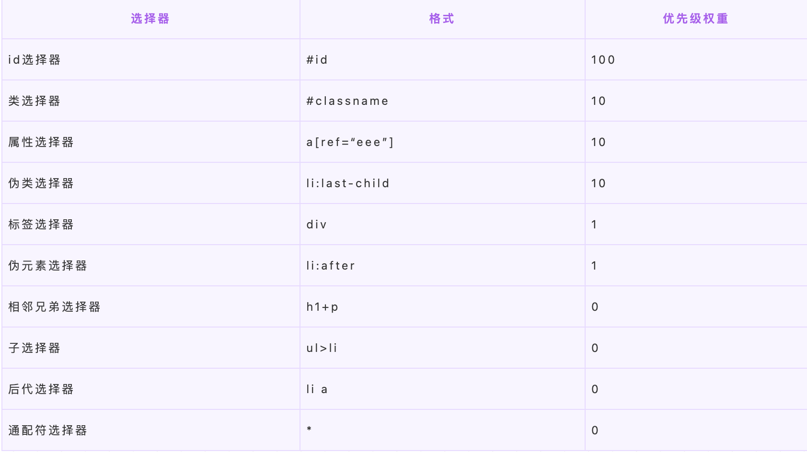
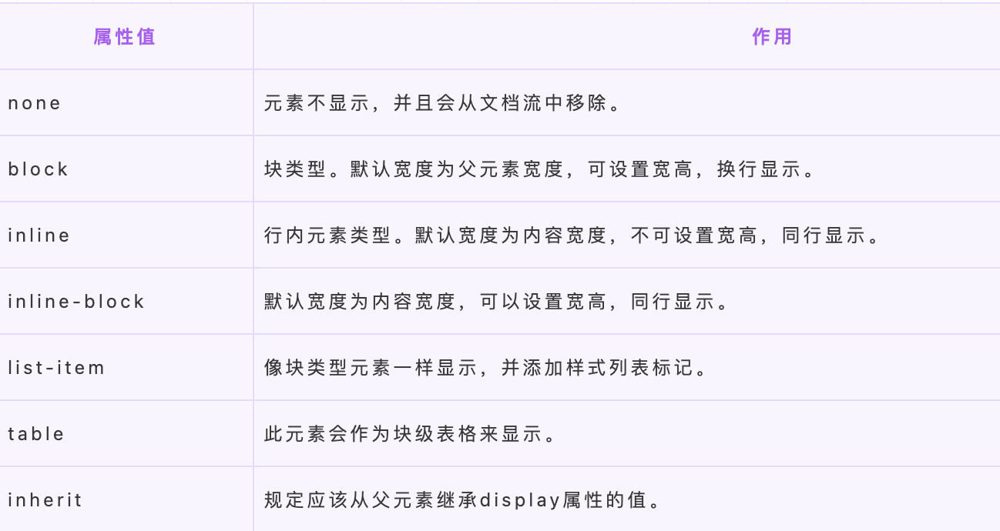

<a name="uztvz"></a>
## 一、CSS基础
<a name="yZNCA"></a>
### 1. CSS选择器及其优先级

对于选择器的**优先级**：

- 标签选择器、伪元素选择器：1
- 类选择器、伪类选择器、属性选择器：10
- id 选择器：100
- 内联样式：1000
<a name="RPfnE"></a>
### 2. CSS中可继承与不可继承属性有哪些
<a name="DMLzI"></a>
#### 2.1 无继承性的属性

1. display:规定元素应该生成的框的类型
2. 文本属性：
3. 盒子模型的属性：width、height、margin、border、padding
4. 背景属性：background、back ground-color、background-image、background-repeat、background-position、background-attachment
5. 定位属性：float、clear、position、top、right、bottom、left、min-width、min-height、max-width、max-height、overflow、clip、z-index
6. 轮廓样式属性：content、counter-reset、counter-increment
7. 页面样式属性：size、page-break-before、page-break-after
8. 声音样式属性：pause-before、pause-after、pause、cue-before、cue-after、cue、play-during
<a name="Y5OBP"></a>
#### 2.2 有继承性的属性

1. 字体系列属性
   - font-family:字体系列
   - font-weight：字体的粗细
   - font-size：字体的大小
   - font-style：字体的风格
2. 文本系列属性
   - text-indent：文本缩进
   - text-align：文本水平对齐
   - line-height：行高
   - word-spacing：单词之间的间距
   - letter-spacing：中文或者字母之间的间距
   - text-transform：控制文本大小写（就是uppercase、lowercase、capitalize这三个）
   - color：文本颜色
3. 元素可见性
   - visibility：控制元素显示隐藏
4. 列表布局属性
   - list-style：列表风格，包括list-style-type、list-style-image等
5. 光标属性
   - cursor:光标显示为何种形态
<a name="HqFse"></a>
### 3. display的属性值及其作用

### 4. display的block、inline和inline-block的区别

1. **block：** 会独占一行，多个元素会另起一行，可以设置width、height、margin和padding属性；
2. **inline：** 元素不会独占一行，设置width、height属性无效。但可以设置水平方向的margin和padding属性，不能设置垂直方向的padding和margin；
3. **inline-block：** 将对象设置为inline对象，但对象的内容作为block对象呈现，之后的内联对象会被排列在同一行内。

对于行内元素和块级元素，其特点如下：

1. 行内元素
   - 设置宽高无效；
   - 可以设置水平方向的margin和padding属性，不能设置垂直方向的padding和margin；
   - 不会自动换行
2. 块级元素
   - 可以设置宽高；
   - 设置margin和padding都有效；
   - 可以自动换行；
   - 多个块状，默认排列从上到下。
<a name="x5IBS"></a>
### 5. 隐藏元素的方法有哪些

- **display: none**：渲染树不会包含该渲染对象，因此该元素不会在页面中占据位置，也不会响应绑定的监听事件。
- **visibility: hidden**：元素在页面中仍占据空间，但是不会响应绑定的监听事件。
- **opacity: 0**：将元素的透明度设置为 0，以此来实现元素的隐藏。元素在页面中仍然占据空间，并且能够响应元素绑定的监听事件。
- **position: absolute**：通过使用绝对定位将元素移除可视区域内，以此来实现元素的隐藏。
- **z-index: 负值**：来使其他元素遮盖住该元素，以此来实现隐藏。
- **clip/clip-path** ：使用元素裁剪的方法来实现元素的隐藏，这种方法下，元素仍在页面中占据位置，但是不会响应绑定的监听事件。
- **transform: scale(0,0)**：将元素缩放为 0，来实现元素的隐藏。这种方法下，元素仍在页面中占据位置，但是不会响应绑定的监听事件。
<a name="GdL3k"></a>
### 6. link和@import的区别
两者都是外部引用CSS的方式，它们的区别如下：

- link是XHTML标签，除了加载CSS外，还可以定义RSS等其他事务；@import属于CSS范畴，只能加载CSS。
- link引用CSS时，在页面载入时同时加载；@import需要页面网页完全载入以后加载。
- link是XHTML标签，无兼容问题；@import是在CSS2.1提出的，低版本的浏览器不支持。
- link支持使用Javascript控制DOM去改变样式；而@import不支持。
<a name="Pbezn"></a>
### 7. transition和animation的区别

- transition是过度属性，强调过度，它的实现需要触发一个事件（比如鼠标移动上去，焦点，点击等）才执行动画。它类似于flash的补间动画，设置一个开始关键帧，一个结束关键帧。
- animation是动画属性，它的实现不需要触发事件，设定好时间之后可以自己执行，且可以循环一个动画。它也类似于flash的补间动画，但是它可以设置多个关键帧（用@keyframe定义）完成动画。
<a name="rlkd0"></a>
### 8.  display:none与visibility:hidden的区别
这两个属性都是让元素隐藏，不可见。两者区别如下：

1. **在渲染树中**
   - **display:none**会让元素完全从渲染树中消失，渲染时不会占据任何空间；
   - **visibility:hidden**不会让元素从渲染树中消失，渲染的元素还会占据相应的空间，只是内容不可见。
2. **是否是继承属性**
- **display:none**是非继承属性，子孙节点会随着父节点从渲染树消失，通过修改子孙节点的属性也无法显示；
- **visibility:hidden**是继承属性，子孙节点消失是由于继承了**hidden**，通过设置
- **visibility:visible**可以让子孙节点显示；
3. 修改常规文档流中元素的 **display** 通常会造成文档的重排，但是修改**visibility**属性只会造成本元素的重绘；
4. 如果使用读屏器，设置为**display:none**的内容不会被读取，设置为**visibility:hidden**的内容会被读取。
<a name="Wfqzr"></a>
### 9. 伪元素和伪类的区别和作用？

- 伪元素：在内容元素的前后插入额外的元素或样式，但是这些元素实际上并不在文档中生成。它们只在外部显示可见，但不会在文档的源代码中找到它们，因此，称为“伪”元素。例如：
```html
p::before {content:"第一章：";}
p::after {content:"Hot!";}
p::first-line {background:red;}
p::first-letter {font-size:30px;}
```

- 伪类：将特殊的效果添加到特定选择器上。它是已有元素上添加类别的，不会产生新的元素。例如：
```html
a:hover {color: #FF00FF}
p:first-child {color: red}
```
**总结：** 伪类是通过在元素选择器上加⼊伪类改变元素状态，⽽伪元素通过对元素的操作进⾏对元素的改变。
<a name="EMOxI"></a>
### 10. 对requestAnimationframe的理解
实现动画效果的方法比较多，Javascript 中可以通过定时器 setTimeout 来实现，CSS3 中可以使用 transition 和 animation 来实现，HTML5 中的 canvas 也可以实现。除此之外，HTML5 提供一个专门用于请求动画的API，那就是 requestAnimationFrame，顾名思义就是**请求动画帧**。<br />MDN对该方法的描述：
:::info
window.requestAnimationFrame() 告诉浏览器——你希望执行一个动画，并且要求浏览器在下次重绘之前调用指定的回调函数更新动画。该方法需要传入一个回调函数作为参数，该回调函数会在浏览器下一次重绘之前执行。
:::
**语法：**window.requestAnimationFrame(callback); 其中，callback是**下一次重绘之前更新动画帧所调用的函数**(即上面所说的回调函数)。该回调函数会被传入DOMHighResTimeStamp参数，它表示requestAnimationFrame() 开始去执行回调函数的时刻。该方法属于**宏任务**，所以会在执行完微任务之后再去执行。<br />**取消动画：** 使用cancelAnimationFrame()来取消执行动画，该方法接收一个参数——requestAnimationFrame默认返回的id，只需要传入这个id就可以取消动画了。<br />优势：

- **CPU节能**：使用SetTinterval 实现的动画，当页面被隐藏或最小化时，SetTinterval 仍然在后台执行动画任务，由于此时页面处于不可见或不可用状态，刷新动画是没有意义的，完全是浪费CPU资源。而RequestAnimationFrame则完全不同，当页面处理未激活的状态下，该页面的屏幕刷新任务也会被系统暂停，因此跟着系统走的RequestAnimationFrame也会停止渲染，当页面被激活时，动画就从上次停留的地方继续执行，有效节省了CPU开销。
- **函数节流**：在高频率事件( resize, scroll 等)中，为了防止在一个刷新间隔内发生多次函数执行，RequestAnimationFrame可保证每个刷新间隔内，函数只被执行一次，这样既能保证流畅性，也能更好的节省函数执行的开销，一个刷新间隔内函数执行多次时没有意义的，因为多数显示器每16.7ms刷新一次，多次绘制并不会在屏幕上体现出来。
- **减少DOM操作**：requestAnimationFrame 会把每一帧中的所有DOM操作集中起来，在一次重绘或回流中就完成，并且重绘或回流的时间间隔紧紧跟随浏览器的刷新频率，一般来说，这个频率为每秒60帧。

**setTimeout执行动画的缺点**：它通过设定间隔时间来不断改变图像位置，达到动画效果。但是容易出现卡顿、抖动的现象；原因是：

- settimeout任务被放入异步队列，只有当主线程任务执行完后才会执行队列中的任务，因此实际执行时间总是比设定时间要晚；
- settimeout任务被放入异步队列，只有当主线程任务执行完后才会执行队列中的任务，因此实际执行时间总是比设定时间要晚；
<a name="WwhJI"></a>
### 11. 对盒模型的理解
CSS3中的盒模型有以下两种：标准盒子模型、IE盒子模型<br /><br /><br />型都是由四个部分组成的，分别是margin、border、padding和content。<br />标准盒模型和IE盒模型的区别在于设置width和height时，所对应的范围不同：

- 标准盒模型的width和height属性的范围只包含了content，
- IE盒模型的width和height属性的范围包含了border、padding和content。

可以通过修改元素的box-sizing属性来改变元素的盒模型：

- box-sizeing: content-box表示标准盒模型（默认值）
- box-sizeing: border-box表示IE盒模型（怪异盒模型）
<a name="MwTdO"></a>
### 12. 为什么有时候用translate来改变位置⽽不是定位？
translate 是 transform 属性的⼀个值。改变transform或opacity不会触发浏览器重新布局（reflow）或重绘（repaint），只会触发复合（compositions）。⽽改变绝对定位会触发重新布局，进⽽触发重绘和复合。transform使浏览器为元素创建⼀个 GPU 图层，但改变绝对定位会使⽤到 CPU。 因此translate()更⾼效，可以缩短平滑动画的绘制时间。 ⽽translate改变位置时，元素依然会占据其原始空间，绝对定位就不会发⽣这种情况。
<a name="uSpek"></a>
### 13.  li 与 li 之间有看不见的空白间隔是什么原因引起的？如何解决？
浏览器会把inline内联元素间的空白字符（空格、换行、Tab等）渲染成一个空格。为了美观，通常是一个**<li>**放在一行，这导致**<li>**换行后产生换行字符，它变成一个空格，占用了一个字符的宽度。<br />解决办法：<br />（1）为<li>设置float:left。不足：有些容器是不能设置浮动，如左右切换的焦点图等。<br />（2）将所有<li>写在同一行。不足：代码不美观。<br />（3）将<ul>内的字符尺寸直接设为0，即font-size:0。不足：<ul>中的其他字符尺寸也被设为0，需要额外重新设定其他字符尺寸，且在Safari浏览器依然会出现空白间隔。<br />（4）消除<ul>的字符间隔letter-spacing:-8px，不足：这也设置了<li>内的字符间隔，因此需要将<li>内的字符间隔设为默认letter-spacing:normal。
<a name="YIVyn"></a>
### 14. CSS3中有哪些新特性

- 新增各种css选择器（: not(.input)：所有 class 不是“input”的节点）
- 圆角 （border-radius:8px）
- 多列布局 （multi-column layout）
- 阴影和反射 （Shadoweflect）
- 文字特效 （text-shadow）
- 文字渲染 （Text-decoration）
- 线性渐变 （gradient）
- 旋转 （transform）
- 增加了旋转,缩放,定位,倾斜,动画,多背景
<a name="PQEyY"></a>
### 15. 替换元素的概念及计算规则
通过修改某个属性值呈现的内容就可以被替换的元素就称为“替换元素”。<br />替换元素除了内容可替换这一特性以外，还有以下特性：

- **内容的外观不受页面上的CSS的影响**：用专业的话讲就是在样式表现在CSS作用域之外。如何更改替换元素本身的外观需要类似appearance属性，或者浏览器自身暴露的一些样式接口。
- **有自己的尺寸**：在Web中，很多替换元素在没有明确尺寸设定的情况下，其默认的尺寸（不包括边框）是300像素×150像素，如
- **在很多CSS属性上有自己的一套表现规则**：比较具有代表性的就是vertical-align属性，对于替换元素和非替换元素，vertical-align属性值的解释是不一样的。比方说vertical-align的默认值的baseline，很简单的属性值，基线之意，被定义为字符x的下边缘，而替换元素的基线却被硬生生定义成了元素的下边缘。
- **所有的替换元素都是内联水平元素**：也就是替换元素和替换元素、替换元素和文字都是可以在一行显示的。但是，替换元素默认的display值却是不一样的，有的是inline，有的是inline-block。

替换元素的尺寸从内而外分为三类：

- **固有尺寸：** 指的是替换内容原本的尺寸。例如，图片、视频作为一个独立文件存在的时候，都是有着自己的宽度和高度的。
- **HTML尺寸：** 只能通过HTML原生属性改变，这些HTML原生属性包括的width和height属性、的size属性。
- **CSS尺寸：** 特指可以通过CSS的width和height或者max-width/min-width和max-height/min-height设置的尺寸，对应盒尺寸中的content box。

这三层结构的计算规则具体如下： <br />（1）如果没有CSS尺寸和HTML尺寸，则使用固有尺寸作为最终的宽高。 <br />（2）如果没有CSS尺寸，则使用HTML尺寸作为最终的宽高。 <br />（3）如果有CSS尺寸，则最终尺寸由CSS属性决定。<br />（4）如果“固有尺寸”含有固有的宽高比例，同时仅设置了宽度或仅设置了高度，则元素依然按照固有的宽高比例显示。 <br />（5）如果上面的条件都不符合，则最终宽度表现为300像素，高度为150像素。 <br />（6）内联替换元素和块级替换元素使用上面同一套尺寸计算规则。
<a name="GIsgE"></a>
### 16. 常见的图片格式及使用场景
（1）**BMP**，是无损的、既支持索引色也支持直接色的点阵图。这种图片格式几乎没有对数据进行压缩，所以BMP格式的图片通常是较大的文件。<br />（2）**GIF**是无损的、采用索引色的点阵图。采用LZW压缩算法进行编码。文件小，是GIF格式的优点，同时，GIF格式还具有支持动画以及透明的优点。但是GIF格式仅支持8bit的索引色，所以GIF格式适用于对色彩要求不高同时需要文件体积较小的场景。<br />（3）**JPEG**是有损的、采用直接色的点阵图。JPEG的图片的优点是采用了直接色，得益于更丰富的色彩，JPEG非常适合用来存储照片，与GIF相比，JPEG不适合用来存储企业Logo、线框类的图。因为有损压缩会导致图片模糊，而直接色的选用，又会导致图片文件较GIF更大。<br />（4）**PNG-8**是无损的、使用索引色的点阵图。PNG是一种比较新的图片格式，PNG-8是非常好的GIF格式替代者，在可能的情况下，应该尽可能的使用PNG-8而不是GIF，因为在相同的图片效果下，PNG-8具有更小的文件体积。除此之外，PNG-8还支持透明度的调节，而GIF并不支持。除非需要动画的支持，否则没有理由使用GIF而不是PNG-8。<br />（5）**PNG-24**是无损的、使用直接色的点阵图。PNG-24的优点在于它压缩了图片的数据，使得同样效果的图片，PNG-24格式的文件大小要比BMP小得多。当然，PNG24的图片还是要比JPEG、GIF、PNG-8大得多。<br />（6）**SVG**是无损的矢量图。SVG是矢量图意味着SVG图片由直线和曲线以及绘制它们的方法组成。当放大SVG图片时，看到的还是线和曲线，而不会出现像素点。SVG图片在放大时，不会失真，所以它适合用来绘制Logo、Icon等。<br />（7）**WebP**是谷歌开发的一种新图片格式，WebP是同时支持有损和无损压缩的、使用直接色的点阵图。从名字就可以看出来它是为Web而生的，什么叫为Web而生呢？就是说相同质量的图片，WebP具有更小的文件体积。现在网站上充满了大量的图片，如果能够降低每一个图片的文件大小，那么将大大减少浏览器和服务器之间的数据传输量，进而降低访问延迟，提升访问体验。目前只有Chrome浏览器和Opera浏览器支持WebP格式，兼容性不太好。

- 在无损压缩的情况下，相同质量的WebP图片，文件大小要比PNG小26%；
- 在有损压缩的情况下，具有相同图片精度的WebP图片，文件大小要比JPEG小25%~34%；
- WebP图片格式支持图片透明度，一个无损压缩的WebP图片，如果要支持透明度只需要22%的格外文件大小。
<a name="szP0T"></a>
### 17. 对 CSSSprites 的理解
CSSSprites（精灵图），将一个页面涉及到的所有图片都包含到一张大图中去，然后利用CSS的 background-image，background-repeat，background-position属性的组合进行背景定位。<br />**优点：**

- 利用CSS Sprites能很好地减少网页的http请求，从而大大提高了页面的性能，这是CSS Sprites最大的优点；
- CSS Sprites能减少图片的字节，把3张图片合并成1张图片的字节总是小于这3张图片的字节总和。

**缺点：**

- 在图片合并时，要把多张图片有序的、合理的合并成一张图片，还要留好足够的空间，防止板块内出现不必要的背景。在宽屏及高分辨率下的自适应页面，如果背景不够宽，很容易出现背景断裂；
- CSSSprites在开发的时候相对来说有点麻烦，需要借助photoshop或其他工具来对每个背景单元测量其准确的位置。
- 维护方面：CSS Sprites在维护的时候比较麻烦，页面背景有少许改动时，就要改这张合并的图片，无需改的地方尽量不要动，这样避免改动更多的CSS，如果在原来的地方放不下，又只能（最好）往下加图片，这样图片的字节就增加了，还要改动CSS。
<a name="GI5bj"></a>
### 18. 什么是物理像素，逻辑像素和像素密度，为什么在移动端开发时需要用到@3x, @2x这种图片？
以 iPhone XS 为例，当写 CSS 代码时，针对于单位 px，其宽度为 414px & 896px，也就是说当赋予一个 DIV元素宽度为 414px，这个 DIV 就会填满手机的宽度；<br />而如果有一把尺子来实际测量这部手机的物理像素，实际为 1242*2688 物理像素；经过计算可知，1242/414=3，也就是说，在单边上，一个逻辑像素=3个物理像素，就说这个屏幕的像素密度为 3，也就是常说的 3 倍屏。<br />对于图片来说，为了保证其不失真，1 个图片像素至少要对应一个物理像素，假如原始图片是 500300 像素，那么在 3 倍屏上就要放一个 1500900 像素的图片才能保证 1 个物理像素至少对应一个图片像素，才能不失真。<br />以 iPhone XS 为例，当写 CSS 代码时，针对于单位 px，其宽度为 414px & 896px，也就是说当赋予一个 DIV元素宽度为 414px，这个 DIV 就会填满手机的宽度；<br />而如果有一把尺子来实际测量这部手机的物理像素，实际为 1242*2688 物理像素；经过计算可知，1242/414=3，也就是说，在单边上，一个逻辑像素=3个物理像素，就说这个屏幕的像素密度为 3，也就是常说的 3 倍屏。<br />对于图片来说，为了保证其不失真，1 个图片像素至少要对应一个物理像素，假如原始图片是 500300 像素，那么在 3 倍屏上就要放一个 1500900 像素的图片才能保证 1 个物理像素至少对应一个图片像素，才能不失真。 <br />当然，也可以针对所有屏幕，都只提供最高清图片。虽然低密度屏幕用不到那么多图片像素，而且会因为下载多余的像素造成带宽浪费和下载延迟，但从结果上说能保证图片在所有屏幕上都不会失真。<br />还可以使用 CSS 媒体查询来判断不同的像素密度，从而选择不同的图片:
```html
my-image { background: (low.png); }
@media only screen and (min-device-pixel-ratio: 1.5) {
  #my-image { background: (high.png); }
}
```
<a name="XQglA"></a>
### 19. margin 和 padding 的使用场景

- 需要在border外侧添加空白，且空白处不需要背景（色）时，使用 margin；
- 需要在border内测添加空白，且空白处需要背景（色）时，使用 padding。
<a name="oCd7P"></a>
### 20.  对line-height 的理解及其赋值方式
**（1）line-height的概念：**

- line-height 指一行文本的高度，包含了字间距，实际上是下一行基线到上一行基线距离；
- 如果一个标签没有定义 height 属性，那么其最终表现的高度由 line-height 决定；
- 一个容器没有设置高度，那么撑开容器高度的是 line-height，而不是容器内的文本内容；
- 把 line-height 值设置为 height 一样大小的值可以实现单行文字的垂直居中；
- line-height 和 height 都能撑开一个高度；

**（2）line-height 的赋值方式：**

- 带单位：px 是固定值，而 em 会参考父元素 font-size 值计算自身的行高
- 纯数字：会把比例传递给后代。例如，父级行高为 1.5，子元素字体为 18px，则子元素行高为 1.5 * 18 = 27px
- 百分比：将计算后的值传递给后代
<a name="ELbgL"></a>
### 21. CSS优化和提高性能的方法有哪些
<a name="LMnIv"></a>
#### 加载性能：

1. css压缩：将写好的css进行打包压缩，可以减小文件体积。
2. css单一样式：当需要下边距和左边距的时候，很多时候会选择使用 margin:top 0 bottom 0；但margin-bottom:bottom;margin-left:left;执行效率会更高。
3. 减少使用@import，建议使用link，因为后者在页面加载时一起加载，前者是等待页面加载完成之后再进行加载。
<a name="qMuJn"></a>
#### 选择器性能：

1. 关键选择器（key selector）。选择器的最后面的部分为关键选择器（即用来匹配目标元素的部分）。CSS选择符是从右到左进行匹配的。当使用后代选择器的时候，浏览器会遍历所有子元素来确定是否是指定的元素等等；
2. 如果规则拥有ID选择器作为其关键选择器，则不要为规则增加标签。过滤掉无关的规则（这样样式系统就不会浪费时间去匹配它们了）。
3. 避免使用通配规则，如*{}计算次数惊人，只对需要用到的元素进行选择。
4. 尽量少的去对标签进行选择，而是用class。
5. 尽量少的去使用后代选择器，降低选择器的权重值。后代选择器的开销是最高的，尽量将选择器的深度降到最低，最高不要超过三层，更多的使用类来关联每一个标签元素。
6. 了解哪些属性是可以通过继承而来的，然后避免对这些属性重复指定规则。
<a name="R04BZ"></a>
#### 渲染性能：

1. 慎重使用高性能属性：浮动、定位。
2. 尽量减少页面重排、重绘。
3. 去除空规则：｛｝。空规则的产生原因一般来说是为了预留样式。去除这些空规则无疑能减少css文档体积。
4. 属性值为0时，不加单位。
5. 属性值为浮动小数0.**，可以省略小数点之前的0。
6. 标准化各种浏览器前缀：带浏览器前缀的在前。标准属性在后。
7. 不使用@import前缀，它会影响css的加载速度。
8. 选择器优化嵌套，尽量避免层级过深。
9. css雪碧图，同一页面相近部分的小图标，方便使用，减少页面的请求次数，但是同时图片本身会变大，使用时，优劣考虑清楚，再使用。
10. 正确使用display的属性，由于display的作用，某些样式组合会无效，徒增样式体积的同时也影响解析性能。
   1. display:inline后不应该再使用width、height、margin、padding以及float。
   2. display:inline-block后不应该再使用float。
   3. display:block后不应该再使用vertical-align（设置行内包括行内块级元素，垂直方向的对齐方式）。
   4. display:table-*后不应该再使用margin或者float
11. 不滥用web字体。对于中文网站来说WebFonts可能很陌生，国外却很流行。web fonts通常体积庞大，而且一些浏览器在下载web fonts时会阻塞页面渲染损伤性能。
<a name="mpaqd"></a>
#### 可维护性、健壮性

1. 将具有相同属性的样式抽离出来，整合并通过class在页面中进行使用，提高css的可维护性。
2. 样式与内容分离：将css代码定义到外部css中。
<a name="pVVZf"></a>
### 22. CSS预处理器/后处理器是什么？为什么要使用它们？
<a name="qbR6F"></a>
#### 预处理器：
如：less，sass，stylus，用来预编译sass或者less，增加了css代码的复用性。层级，mixin， 变量，循环， 函数等对编写以及开发UI组件都极为方便。
<a name="lcseK"></a>
#### 后处理器：
如： postCss，通常是在完成的样式表中根据css规范处理css，让其更加有效。目前最常做的是给css属性添加浏览器私有前缀，实现跨浏览器兼容性的问题。<br />css预处理器为css增加一些编程特性，无需考虑浏览器的兼容问题，可以在CSS中使用变量，简单的逻辑程序，函数等在编程语言中的一些基本的性能，可以让css更加的简洁，增加适应性以及可读性，可维护性等。<br />其它css预处理器语言：Sass（Scss）, Less, Stylus, Turbine, Swithch css, CSS Cacheer, DT Css。<br />使用原因：<br />结构清晰， 便于扩展<br />可以很方便的屏蔽浏览器私有语法的差异<br />可以轻松实现多重继承<br />完美的兼容了CSS代码，可以应用到老项目中
<a name="qPc8A"></a>
### 23. ::before 和 :after 的双冒号和单冒号有什么区别？

1. 冒号(:)用于CSS3伪类，双冒号(::)用于CSS3伪元素。
2. ::before就是以一个子元素的存在，定义在元素主体内容之前的一个伪元素。并不存在于dom之中，只存在在页面之中。

注意： :before 和 :after 这两个伪元素，是在CSS2.1里新出现的。起初，伪元素的前缀使用的是单冒号语法，但随着Web的进化，在CSS3的规范里，伪元素的语法被修改成使用双冒号，成为::before、::after。
<a name="y6anG"></a>
### 24. display:inline-block 什么时候会显示间隙

- 有空格时会有间隙，可以删除空格解决；
- margin正值时，可以让margin使用负值解决；

