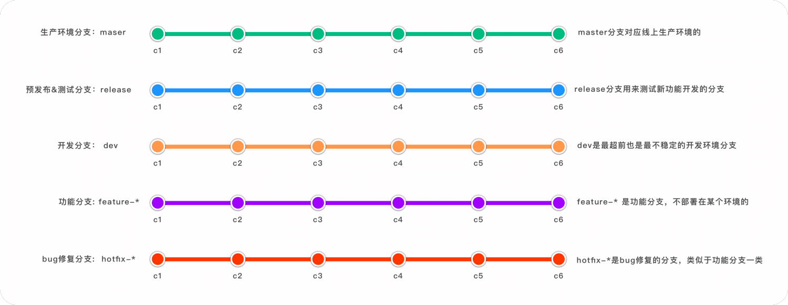
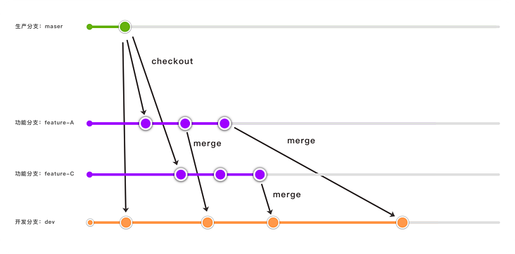

#### 代码运行的环境
一般来说，团队都会有至少这几个环境：

- **本地开发环境**：

开发人员自测的，可以是自己本地部署的静态服务器，当然也可类似是运行 npm server类似的环境，本地环境运行的代码可以是任何分支的

- **dev开发环境**：

这个环境是用开发分支**dev**产出的代码来部署的，唯一的公用的

- **测试&预发布环境**：

这个环境是用开发分支**release**产出的代码来部署的，唯一的公用的

- **线上生产环境**：

这个环境是用开发分支**master**产出的代码来部署的，唯一的公用的

#### git 分支模型
先看一下分支的角色功能  

##### 分支的策略

dev 是公共的开发分支，不会合并到其他分支去的  

所有的分支都是基于**master**分支检出

- master ：**保护分支**，对应的就是生产环境的分支
- release：**保护分支**，所有开发完成的分支会申请合并到release分支，提供给测试人员测试
- feature-*：**功能分支**，具体功能开发
- dev：**开发分支&脏分支**，对应的是大家共用的开发环境，上面的代码会部署到一个公共的开发环境，供开发人员做自测，应付一些日常、非日常的调试
- hotfix-*：**bug紧急修复分支**，可以直接合并到master，（假如release合并了几个feature分支，正在测试的情况下，发现需要紧急修复的buf，紧急修复测试完毕后，可以直接合并到master，如果合并到release，在由release合并到master，那些正在测试的功能或者还不准备上线的功能就会跟着直接上线了）

工作流程大概是：

1. 接到需求文档，做评审后分配个每个人或小组的功能开发，相关人员从master 检出功能分支
2. 开发的时候除了会在本地测试，有需要还会合并到dev分支，在公共的开发环境去自己做测试
3. 因为在开发功能的期间，可能有hotfix完成合并到master，合并代码的时候习惯merge一下master，防止冲突等
4. 自测完成之后，申请合并到release，合并成功后部署到测试环境后通知测试人员做测试
5. 测试通过后，release申请合并到master，准备上线
6. 如果测试不通过，在功能分支修改后重新merge
7. 上线成功稳定后删除对应的功能分支，dev 合并最新的master分支

