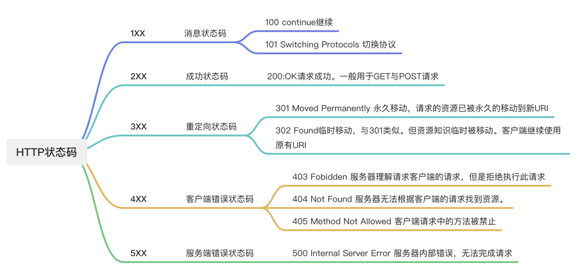
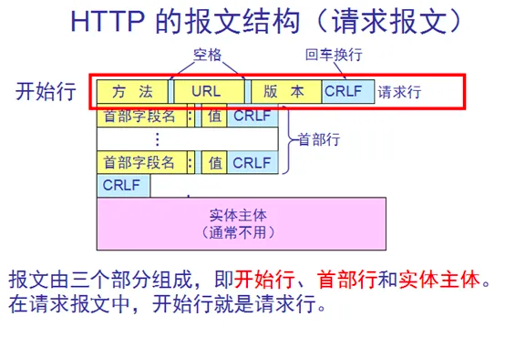
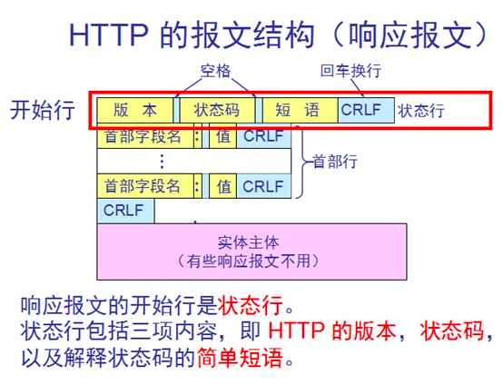

<a name="Z9Lva"></a>
## XMLHttpRequest
Ajax 的核心是 XMLHttpRequest 对象。XMLHttpRequest 对象用于同幕后服务器交换数据。这意味着可以更新网页的部分，而不需要重新加载整个页面。

| 方法 | 描述 |
| --- | --- |
| new XMLHttpRequest() | 创建新的 XMLHttpRequest 对象 |
| abort() | 取消当前请求 |
| getAllResponseHeaders() | 返回头部信息 |
| getResponseHeader() | 返回特定的头部信息 |
| open(_method_, _url_, _async_, _user_, _psw)_ | 规定请求<br />- method：请求类型 GET 或 POST<br />- url：文件位置<br />- async：true（异步）或 false（同步）<br />- user：可选的用户名称<br />- psw：可选的密码<br /> |
| send() | 将请求发送到服务器，用于 GET 请求 |
| send(_string_) | 将请求发送到服务器，用于 POST 请求 |
| setRequestHeader() | 向要发送的报头添加标签/值对 |

<a name="goFPG"></a>
### XMLHttpRequest 对象属性
| 属性 | 描述 |
| --- | --- |
| onreadystatechange | 定义当 readyState 属性发生变化时被调用的函数 |
| readyState | 保存 XMLHttpRequest 的状态。<br />- 0：请求未初始化<br />- 1：服务器连接已建立<br />- 2：请求已收到<br />- 3：正在处理请求<br />- 4：请求已完成且响应已就绪<br /> |
| responseText | 以字符串返回响应数据 |
| responseXML | 以 XML 数据返回响应数据 |
| status | 返回请求的状态号<br />- 200: "OK"<br />- 403: "Forbidden"<br />- 404: "Not Found"<br /> |
| statusText | 返回状态文本（比如 "OK" 或 "Not Found"） |

<a name="ybxXY"></a>
## HTTP状态码
<a name="djAiq"></a>
### 常见状态码


<a name="oTQVn"></a>
#### 详情见：
[https://baike.baidu.com/item/HTTP%E7%8A%B6%E6%80%81%E7%A0%81/5053660](https://baike.baidu.com/item/HTTP%E7%8A%B6%E6%80%81%E7%A0%81/5053660)

| 状态码 | 描述 |
| --- | --- |
| 成功 |  |
| 200 OK | OK请求成功，正常状态 |
| 201 Created | [Created](https://baike.baidu.com/item/Created/4243877?fromModule=lemma_inlink)请求已实现，建立新的资源，其 URI 已经随Location 头信息返回 |
| 202 Accepted | 服务器已接受请求，但尚未处理，最终该请求可能会也可能不会被执行。 |
| 203 Non-Authoritative Information | 服务器已成功处理了请求，但返回的实体头部[元信息](https://baike.baidu.com/item/%E5%85%83%E4%BF%A1%E6%81%AF/7554993?fromModule=lemma_inlink)不是在原始服务器上有效的确定集合 |
| 204 No Content | 服务器成功处理了请求，但不需要返回任何实体内容 |
| 205 Reset Content | 服务器成功处理了请求，且没有返回任何内容。但是与204响应不同，返回此状态码的响应要求请求者重置文档视图。该响应主要是被用于接受用户输入后，立即重置表单，以便用户能够轻松地开始另一次输入。 |
| 206 Partial Content | 服务器已经成功处理了部分 GET 请求，请求必须包含 Range 头信息来指示客户端希望得到的内容范围，并且可能包含 If-Range 来作为请求条件。 |
| 207 Multi-Status | 由WebDAV(RFC 2518)扩展的状态码，代表之后的消息体将是一个XML消息，并且可能依照之前子请求数量的不同，包含一系列独立的响应代码。 |
| 重定向 |  |
| 300 Multiple Choices | 被请求的资源有一系列可供选择的回馈信息，每个都有自己特定的地址和浏览器驱动的商议信息。用户或浏览器能够自行选择一个首选的地址进行重定向。 |
| 301 Moved Permanently | 被请求的资源已永久移动到新位置，并且将来任何对此资源的引用都应该使用本响应返回的若干个 URI 之一。 |
| 302 Move Temporarily | 请求的资源临时从不同的 URI响应请求。由于这样的重定向是临时的，客户端应当继续向原有地址发送以后的请求。只有在Cache-Control或Expires中进行了指定的情况下，这个响应才是可缓存的。 |
| 303 See Other | 对应当前请求的响应可以在另一个 URL 上被找到，而且客户端应当采用 GET 的方式访问那个资源。这个方法的存在主要是为了允许由脚本激活的POST请求输出重定向到一个新的资源。这个新的 URI 不是原始资源的替代引用。同时，303响应禁止被缓存。当然，第二个请求（重定向）可能被缓存。 |
| 304 Not Modified | 如果客户端发送了一个带条件的 GET 请求且该请求已被允许，而文档的内容（自上次访问以来或者根据请求的条件）并没有改变，则服务器应当返回这个状态码。 |
| 305 Use Proxy | 被请求的资源必须通过指定的代理才能被访问。Location 域中将给出指定的代理所在的 URI 信息，接收者需要重复发送一个单独的请求，通过这个代理才能访问相应资源。只有原始服务器才能建立305响应。 |
| 307 Temporary Redirect | 请求的资源临时从不同的URI 响应请求。 |
| 请求错误 |  |
| 400 Bad Request | 当前请求需要用户验证。该响应必须包含一个适用于被请求资源的 WWW-Authenticate 信息头用以询问用户信息。 |
| 402 Payment Required | 该状态码是为了将来可能的需求而预留的 |
| [403 Forbidden](https://baike.baidu.com/item/403%20Forbidden/5101750?fromModule=lemma_inlink) | 服务器已经理解请求，但是拒绝执行它。与401响应不同的是，身份验证并不能提供任何帮助，而且这个请求也不应该被重复提交。 |
| 404 Not Found | 请求失败，请求所希望得到的资源未被在服务器上发现。 |
| 405 Method Not Allowed | 请求行中指定的请求方法不能被用于请求相应的资源。该响应必须返回一个Allow 头信息用以表示出当前资源能够接受的请求方法的列表。鉴于 PUT，DELETE 方法会对服务器上的资源进行写操作，因而绝大部分的网页服务器都不支持或者在默认配置下不允许上述请求方法，对于此类请求均会返回405错误。 |
| 406 Not Acceptable | 请求的资源的内容特性无法满足请求头中的条件，因而无法生成响应实体。 |
| 407 Proxy Authentication Required | 与401响应类似，只不过客户端必须在代理服务器上进行身份验证。代理服务器必须返回一个 [Proxy](https://baike.baidu.com/item/Proxy/612388?fromModule=lemma_inlink)-Authenticate 用以进行身份询问。客户端可以返回一个 Proxy-Authorization 信息头用以验证。 |
| 408 Request Timeout | 请求超时。客户端没有在服务器预备等待的时间内完成一个请求的发送。客户端可以随时再次提交这一请求而无需进行任何更改。 |
| 409 Conflict | 由于和被请求的资源的当前状态之间存在冲突，请求无法完成。这个代码只允许用在这样的情况下才能被使用：用户被认为能够解决冲突，并且会重新提交新的请求。该响应应当包含足够的信息以便用户发现冲突的源头。 |
| 410 Gone | 被请求的资源在服务器上已经不再可用，而且没有任何已知的转发地址。410响应的目的主要是帮助[网站管理员](https://baike.baidu.com/item/%E7%BD%91%E7%AB%99%E7%AE%A1%E7%90%86%E5%91%98/257577?fromModule=lemma_inlink)维护网站，通知用户该资源已经不再可用 |
| 411 Length Required | 服务器拒绝在没有定义 Content-Length 头的情况下接受请求。在添加了表明请求消息体长度的有效 Content-Length 头之后，客户端可以再次提交该请求。 |
| 412 Precondition Failed | 服务器在验证在请求的头字段中给出[先决条件](https://baike.baidu.com/item/%E5%85%88%E5%86%B3%E6%9D%A1%E4%BB%B6/8307866?fromModule=lemma_inlink)时，没能满足其中的一个或多个。这个状态码允许客户端在获取资源时在请求的元信息（请求头字段数据）中设置先决条件，以此避免该请求方法被应用到其希望的内容以外的资源上。 |
| 413 Request Entity Too Large | 服务器拒绝处理当前请求，因为该请求提交的实体数据大小超过了服务器愿意或者能够处理的范围。此种情况下，服务器可以关闭连接以免客户端继续发送此请求。如果这个状况是临时的，服务器应当返回一个 Retry-After 的响应头，以告知客户端可以在多少时间以后重新尝试。 |
| 414 Request-URI Too Long | 请求的URI 长度超过了服务器能够解释的长度，因此服务器拒绝对该请求提供服务。 |
| 415 Unsupported Media Type | 对于当前请求的方法和所请求的资源，请求中提交的实体并不是服务器中所支持的格式，因此请求被拒绝。 |
| 416 Requested Range Not Satisfiable | 如果请求中包含了 Range 请求头，并且 Range 中指定的任何数据范围都与当前资源的可用范围不重合，同时请求中又没有定义 If-Range 请求头，那么服务器就应当返回416状态码。 |
| 417 Expectation Failed | 在请求头 Expect 中指定的预期内容无法被服务器满足，或者这个服务器是一个代理服务器，它有明显的证据证明在当前路由的下一个节点上，Expect 的内容无法被满足。 |
| 421Misdirected Request | 请求被指向到无法生成响应的服务器（比如由于连接重复使用） |
| 422 Unprocessable Entity | 请求格式正确，但是由于含有[语义错误](https://baike.baidu.com/item/%E8%AF%AD%E4%B9%89%E9%94%99%E8%AF%AF/22905841?fromModule=lemma_inlink)，无法响应。 |
| 423 Locked | 当前资源被锁定。 |
| 424 Failed Dependency | 由于之前的某个请求发生的错误，导致当前请求失败，例如 PROPPATCH。（RFC 4918 WebDAV） |
| 425 Too Early | 状态码 425 Too Early 代表服务器不愿意冒风险来处理该请求，原因是处理该请求可能会被“重放”，从而造成潜在的[重放攻击](https://baike.baidu.com/item/%E9%87%8D%E6%94%BE%E6%94%BB%E5%87%BB/2229240?fromModule=lemma_inlink)。 |
| 426 Upgrade Required | 客户端应当切换到TLS/1.0。 |
| 449 Retry With | 由[微软](https://baike.baidu.com/item/%E5%BE%AE%E8%BD%AF/124767?fromModule=lemma_inlink)扩展，代表请求应当在执行完适当的操作后进行重试。 |
| 服务器错误（5、6字头） |  |
| 500 Internal Server Error | 服务器遇到了一个未曾预料的状况，导致了它无法完成对请求的处理。一般来说，这个问题都会在服务器端的[源代码](https://baike.baidu.com/item/%E6%BA%90%E4%BB%A3%E7%A0%81/3969?fromModule=lemma_inlink)出现错误时出现。 |
| 501 Not Implemented | 服务器不支持当前请求所需要的某个功能。当服务器无法识别请求的方法，并且无法支持其对任何资源的请求。 |
| [502 Bad Gateway](https://baike.baidu.com/item/502%20Bad%20Gateway/858572?fromModule=lemma_inlink) | 作为网关或者代理工作的服务器尝试执行请求时，从上游服务器接收到无效的响应。 |
| 503 [Service Unavailable](https://baike.baidu.com/item/Service%20Unavailable/10496414?fromModule=lemma_inlink) | 由于临时的服务器维护或者过载，服务器当前无法处理请求。这个状况是临时的，并且将在一段时间以后恢复。如果能够预计[延迟时间](https://baike.baidu.com/item/%E5%BB%B6%E8%BF%9F%E6%97%B6%E9%97%B4/11026093?fromModule=lemma_inlink)，那么响应中可以包含一个 Retry-After 头用以标明这个延迟时间。 |
| 504 Gateway Timeout | 作为网关或者代理工作的服务器尝试执行请求时，未能及时从上游服务器（URI标识出的服务器，例如HTTP、[FTP](https://baike.baidu.com/item/FTP/13839?fromModule=lemma_inlink)、[LDAP](https://baike.baidu.com/item/LDAP/2875565?fromModule=lemma_inlink)）或者辅助服务器（例如DNS）收到响应。 |
| 505 HTTP Version Not Supported | 服务器不支持，或者拒绝支持在请求中使用的 HTTP 版本。这暗示着服务器不能或不愿使用与客户端相同的版本。响应中应当包含一个描述了为何版本不被支持以及服务器支持哪些协议的实体。 |
| 506 Variant Also Negotiates | 被请求的协商变元资源被配置为在透明内容协商中使用自己，因此在一个协商处理中不是一个合适的重点。 |
| 507 Insufficient Storage | 服务器无法存储完成请求所必须的内容。这个状况被认为是临时的。 |
| 509 [Bandwidth](https://baike.baidu.com/item/Bandwidth/6216429?fromModule=lemma_inlink) Limit Exceeded | 服务器达到带宽限制。这不是一个官方的状态码，但是仍被广泛使用。 |
| 510 Not Extended | 获取资源所需要的策略并没有被满足。 |
| 600 Unparseable Response Headers | 源站没有返回响应头部，只返回实体内容。 |

<a name="GZLaM"></a>
## HTTP Request与HTTP Response
<a name="R6P5O"></a>
### 什么是HTTP Request与HTTP Response

- Request故名思议，就是浏览器要向服务器发出请求。
- 服务器针对浏览器的请求Request，做相应处理，进行相应Response。
- 浏览器收到服务器的Response信息后，会对信息进行相应处理，然后展示给我们。

上面的三个过程，其实就是两个程序之间的对话，或者叫做两个进程之间的对话，其中一个程序是浏览器，被称作客户端或者Client，用来发送Request；另一个程序是Web服务器，可以是apache等等，用来针对用户的Request，做出相应的Response，称为服务器端或者Server。<br />Client与Server之间传送数据，对方如何能够识别彼此之间传送的信息呢？那么就需要彼此之间传送信息遵循一定的规范，这就是**HTTP协议，**因此叫做**HTTP** Request和**HTTP** Response。
<a name="KBkeo"></a>
### request
  
主要由三部分组成：<br />1）HTTP Request Method，URI，Protocol Version<br />该部分位于HTTP Request的首行，包含HTTP Request Method，URI，Protocol Version三部分，例如“**GET /test.html HTTP/1.1**”，表示HTTP Request Method为GET方法，URI为/test.htlm，HTTP协议版本号为1.1。<br />2）HTTP Request Headers：<br />该部分为Request的头部信息，包含有编码信息，请求客户端类型等等信息。<br />3）HTTP Request Body：<br />该部分含有Request的主体信息，与HTTP Request Header之间隔开一行。
<a name="cCBtf"></a>
### response

与HTTP Request数据格式类似，也包含三部分信息。<br />1）Protocol/Version，Status Code，Description<br />2）HTTP Response Headers<br />3）HTTP Response Body
<a name="cZiYU"></a>
### 为什么我们需要Session？
客户端与服务器端通过HTTP Request和HTTP Response进行数据通信，根据HTTP Request和HTTP Response数据格式进行数据解析，但是还有一个问题，那就是HTTP是无状态协议（ stateless protocol），也就是说每次客户端向服务器端Request，服务器端都会认为是一个新的Request，无法记录客户端的信息，这种情况就会导致很多问题，例如我们登陆进一个网站，如果我们需要访问别的页面，我们点击完链接后，服务器会认为是一个新的用户，如果该页面需要验证用户信息，那么客户端就需要重新输入登陆信息，导致很多的问题。<br />　　如何解决这个问题呢？就是通过Session。<br />　　服务器端对于访问的客户端，会生成该客户端的唯一信息，存储在Session中，Session位于服务器，可以保存在服务器的内存中，也可以保存在文件系统中，也可以保存在服务器的数据库中，对于Session的管理，也是值得琢磨的一件事情。<br />　　有了Session还不够，因为每次访问的客户端都是一次新的Request，因此需要在Request的信息中包含有客户端的信息，才能够与服务器端的Session进行对比，来确定是不是同一个客户端。所以需要Session Tracking，才能正确的辨识客户端。
<a name="eD1Ke"></a>
### 如何进行Session Tracking
Request的信息中包含有客户端的信息，主要有三种方式：<br />　　1）Cookies<br />　　存储在客户端，**每一个cookie与一个唯一的SessionID关联**，当客户端发送Request的时候，该信息会一块发过去，然后服务器端就能够根据Cookie的信息与Session的信息比对，来判断客户端的Request是否第一次请求；<br />　　Cookie中会包含过期时间信息，如果Cookie过期，那么服务器端也会认为是第一次Request，进而需要用户登录；<br />　　Cookies中还能包含其他敏感信息，而且在客户端保存，因此可能会产生风险，想想也是，毕竟尝到了小甜头，自然要承受一定的风险；<br />　　为了避免Cookies产生的风险，许多浏览器可以禁止Cookie；<br />　　禁止Cookie后，有些网站就无法登录了，例如博客园，如果在浏览器中禁止Cookie，就无法登录了。<br />　　2）URL Rewriting<br />　　对于客户端禁用Cookie的情况，如果还想能够识别Request，那么就可以使用URL Rewriting的方法，在URL中会包含一段信息，这段信息能够与相应的Session唯一对应，这样当URL传到服务器端后就能够判断特定的Session了。通过URL Rewriting，无需在客户端保存有Cookies信息，与特定Session相关联的信息直接通过URL来回传输。<br />　　对于采用URL Rewriting方法的，如果我们保存一个网址为标签后，那么以后再打开标签的话，会提示Session过期,因为Session有一定的时间期限，过期后，服务器端就会删除相应的Session信息，以节省资源。<br />　　3）使用Hidden类型的Form标签<br />　　除了上面的两种方法，也可以通过 hidden类型的form标签，例如<input type="hidden".../>，这种方式有两个缺点：一是我们可以通过HTML源代码就能够看到一些信息，甚至是一些敏感信息；二是为了区分不同的用户，该方法只能够用在动态网页中，对于纯HTML的，就没有办法了。
<a name="TTReQ"></a>
## 跨域问题
<a name="lqOqQ"></a>
### 什么是跨域
要了解什么是跨域，我们先说一下同源的概念。同源，是指协议、域名、端口都相同。<br />        例如：[http://192.168.0.1:8080](http://192.168.0.1:8080)与[https://192.168.3.1:8080](https://192.168.3.1:8080)不是同源，因为协议不同，第一个冒号前面的为协议，中间的为域名，第二个冒号后面的为端口，只要满足有一处不同，则就不是同源。<br />        所谓跨域就是从 A 向 B 发请求，如若他们的地址协议、域名、端口都不相同，直接访问就会造成跨域问题，跨域是非常常见的现象！请求是跨域的但并不一定会报错，普通的图片请求。css文件请求是不会报错的。报错的条件是浏览器的同源策略，且发送Ajax请求，跨域是客户端问题。
<a name="p925A"></a>
### 为什么要跨域
 为了安全起见，浏览器设置了同源策略，当页面执行脚本的时候，浏览器会检查访问的资源是否同源，如果不是，就会报错。
<a name="aNQ0S"></a>
### 如何解决跨域
<a name="FSsAZ"></a>
#### JSONP
利用的是 script 标签 src 属性请求 js 无跨域问题，但具有局限性，只能发送 get 请求。
<a name="WId2a"></a>
#### CORS
  当请求违反了同源策略，就在请求头添加 Access-Control-Allow-Origin 属性，浏览器会判断响应中 Access-Control-Allow-Origin 值是否和当前的地址相同，匹配成功后才会做响应处理，否则继续报错。缺点是会忽略cookie，而且对浏览器版本有一定的要求
<a name="ltIHg"></a>
#### nginx反向代理接口跨域
可以将前端项目部署到和接口同源的当前本地的服务器上。在vue.config.js 中进行代理配置，假设当我访问 [http://localhost:9528/api/login](http://localhost:9528/api/login) 时会转换为间接访问 [http://localhost:3000/api/login](http://localhost:3000/api/login)
```javascript
devServer: {
    // 其他代码省略。。。。。
    
    // 代理配置
    proxy: {
      // 代理服务器，当请求的网址是http://localhost:3000的时候，会转成http://192.168.80.115:3000
      // /api 是 看接口文档所写的，每当访问本地的/api接口时，会转化为访问真实的服务器
      '/api': {
        target: 'http://localhost:3000' // 我们要代理的真实接口地址
      }
    }
```
<a name="jTDE3"></a>
#### web sockets
  它是一种浏览器的API，它的目标是在一个单独的持久连接上提供全双工、双向通信。(同源策略对web sockets不适用)web sockets原理：在JS创建了web socket之后，会有一个HTTP请求发送到浏览器以发起连接。取得服务器响应后，建立的连接会使用HTTP升级从HTTP协议交换为web sockt协议。 只有在支持web socket协议的服务器上才能正常工作。


