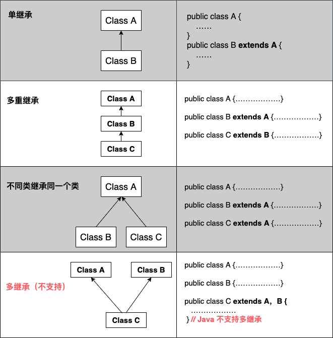
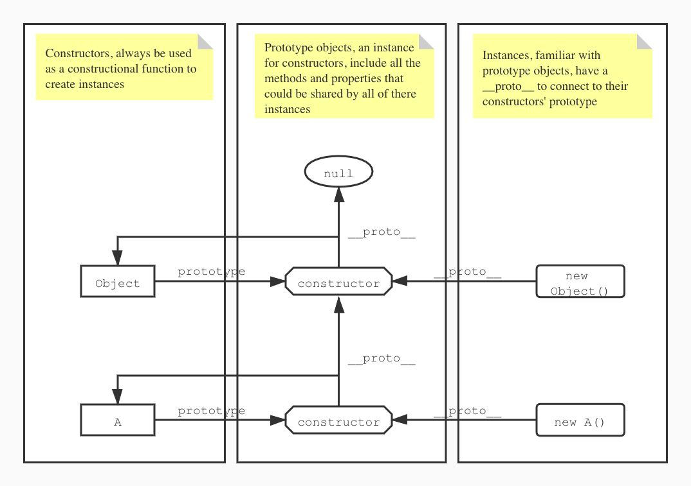
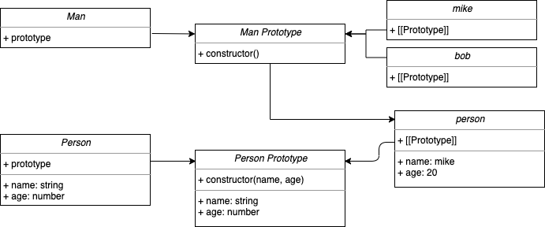
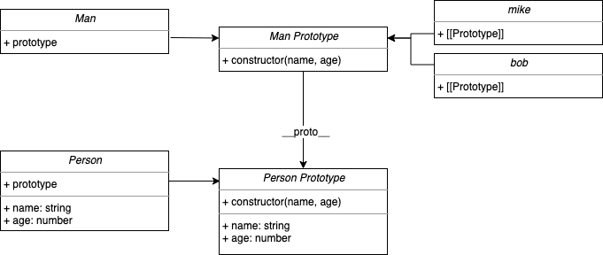
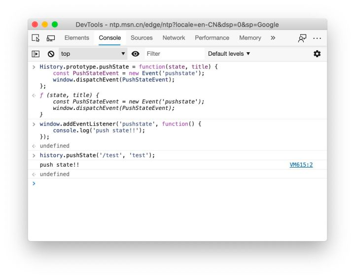

<a name="N32PL"></a>
## 什么是面向对象？
<a name="CaZz9"></a>
### 对象是什么？
对象是由数据和允许的操作组成的包，它与目标实体有直接的对应关系。对象是一个容器，封装了属性(property)和方法(method)属性是对象的状态，方法是对象的行为（完成某种任务）。比如，我们可以把动物抽象为animal对象，使用“属性”记录具体是那一种动物，使用“方法”表示动物的某种行为（奔跑、捕猎、休息等等） 在实际开发中，对象是一个抽象的概念，可以将其简单理解为 : 数据集或功能集。
<a name="UN3q5"></a>
### 面向对象
面向对象，是把事务分解成一个一个对象，然后对象之间分工与合作。<br />是以对象功能来划分问题，而不是步骤。<br />在面向对象程序开发思想中，每一个对象都是功能中心，具有明确分工。
<a name="SEIPv"></a>
#### 面向过程：
将大象装进冰箱(需要几步)，面向过程做法<br />打开冰箱门<br />大象装进去<br />关山冰箱门
<a name="n6aLd"></a>
#### 面向对象
先找出对象，并写出这些对象的功能：<br />大象对象<br />打开冰箱门<br /> *进去<br />冰箱对象<br />*打开<br />*关闭<br /> 使用大象和冰箱的功能

<a name="ZYZvX"></a>
## 面向对象的三大特性
<a name="fnGXC"></a>
## 1、封装：
封装是将过程和数据包围起来，数据只能通过定义的接口访问。面向对象计算从一个基本概念开始，即现实世界可以表示为一系列完全自治的、封装的对象，这些对象通过受保护的接口访问其他对象。
<a name="FBaH8"></a>
## 2、继承：
继承是一种层次模型，它连接类，允许并鼓励类的重用，提供了一种明确表达共性的方法。对象的新类可以从现有类派生，这个过程称为类继承。新类继承原类的属性。新类被称为原类的派生类（子类），原类被称为新类的基类（父类）。
<a name="GN1pK"></a>
## 3、多态：
多态允许不同类的对象响应相同的消息。例如，同样的加法，两次相加和两个整数相加，一定是完全不同的。多态语言具有灵活性、抽象性、行为共享性和代码共享性等优点，较好地解决了应用程序功能的同名问题。

<a name="CZZcn"></a>
## java
<a name="B44dw"></a>
### 继承类型
需要注意的是 Java 不支持多继承，但支持多重继承。

### 继承的特性

- 子类拥有父类非 private 的属性、方法。
- 子类可以拥有自己的属性和方法，即子类可以对父类进行扩展。
- 子类可以用自己的方式实现父类的方法。
- Java 的继承是单继承，但是可以多重继承，单继承就是一个子类只能继承一个父类，多重继承就是，例如 B 类继承 A 类，C 类继承 B 类，所以按照关系就是 B 类是 C 类的父类，A 类是 B 类的父类，这是 Java 继承区别于 C++ 继承的一个特性。
- 提高了类之间的耦合性（继承的缺点，耦合度高就会造成代码之间的联系越紧密，代码独立性越差）
- 如果没有显示的声明一个类的父类，则此继承于java.lang.Object类。所有的java类（除java.lang.Object类）都直接或间接继承于java.lang.Object类。
<a name="LLu3l"></a>
### 封装
<a name="ISNwL"></a>
#### 封装：

- 程序设计追求“高内聚，低耦合”。

  - 高内聚：类的内部数据操作细节自己完成，不允许外部干涉；               
  - 低耦合：仅对外暴露少量的方法用于使用；

- 隐藏：
  - 隐藏对象内部的复杂性，只对外公开简单的接口。便于外界调用，从而提高系统的可扩展性、可维护性。通俗的说，把该隐藏的隐藏起来，该暴露的暴露出来。
```java
//封装性思想具体的代码体现


//体现一：针对属性
private double radius;  //将类的属性私有化（private)
public void setRadius(double radius){
    this.radius = radius;
}
public double getRadius(){  //同时提供公共的（public）方法来获取和设置此属性的值。
    return radius;
}


//体现二：针对方法
private int getRandomNum(){ //私有化方法，不对外暴露
    return (int)(Math.random()*100);
}


//体现三：针对构造器（单例模式）
class Bank{
    private Bank(){    //私有化类的构造器

    }

    private static Bank instance = new Bank();

    public static Bank getInstance(){
        return instance;
    }
}


//体现四：如果不希望类在包外被调用，可以将类设置为缺省的。

```
<a name="Z6HK4"></a>
#### Java规定的四种权限修饰符
权限从小到大顺序为：private  <   缺省  <  protected  <  public<br />以上四种权限修饰符都可以用来修饰类的内部结构：属性、方法、构造器、内部类<br />但修饰类的话，只能使用：缺省defaut、public<br />Java权限修饰符public、protected、缺省、private置于类的成员定义前。用来限定对象对该类成员的访问权限。

| 修饰符 | 类内部 | 同一个包 | 不同包的子类 | 同一个工程 |
| --- | --- | --- | --- | --- |
| private | yes |  |  |  |
| 缺省default | yes | yes |  |  |
| protected | yes | yes | yes |  |
| public | yes | yes | yes | yes |

<a name="Hs9Dq"></a>
### 多态性
  对象的多态性指：父类的引用指向子类的对象或者说子类的对象赋给父类的引用。（向上转型）
```java
 
Person p = new Student();   //Person类型的变量p,指向Student类型的对象
Object o = new Person();    //Object类型的变量o,指向Person类型的对象
o = new Student();          //Object类型的变量o,指向Student类型的对象
```
<a name="nb8fx"></a>
#### 引用变量的两个类型
<a name="cQ6Mr"></a>
##### 编译时的类型
由声明该变量时使用的类型决定
<a name="g5Ztc"></a>
##### 运行时的类型
由实际赋给该变量的对象决定
<a name="fCl7V"></a>
##### 总结

- 编译时看左边；父类引用（父类中不具备子类特有的方法）
- 运行时看右边。子类对象（实际运行的是子类重写父类的方法）  
- 若编译时类型和运行时类型不一致，就出现了对象的多态性。 
- 一个引用变量可能指向多种不同类型的对象。
```java
 
public class Test {
 
    public void method(Person p){  //方法的参数类型为父类Person类型
        p.getInfo();
        //...
    }
 
 
    public static void main(String args[]){
        Test test = new Test();
    
        Student s = new Student();
        test.method(s);           // 子类的对象s传给父类类型的参数p
    }
}
```
<a name="QcGUF"></a>
##### 多态性的使用：虚拟方法调用（Virtual Method Invocation）
<a name="gEXWM"></a>
###### 正常方法的调用
```java
 
Person p = new Person();
p.getInfo();
 
Student s = new Student();
s.getInfo();
```
<a name="fLEsK"></a>
###### 虚拟方法调用（多态情况下）
 子类中定义了与父类同名同参数的方法，在多态情况下，将此时父类的方法称为虚拟方法，父类根据赋给它的不同子类对象，动态调用属于子类的该方法。这样的方法调用在编译期是无法确定的。
```java
 
Person p = new Student();
p.getInfo();     //调用的是Student类中的getInfo()方法
```
解释： 编译时p为Person类型，而方法的调用是在运行时确定的，所以调用的是Student类的getInfo()方法。称为动态绑定<br />只有等到方法调用的那一刻解释运行器才会确定所要调用的具体方法，这称为 “晚绑定”或“动态绑定 ” 。
<a name="Bux7v"></a>
##### 小结：
<a name="CkhnR"></a>
###### 多态作用
提高了代码的通用性，常作接口重用
<a name="Oj2Ds"></a>
###### 前提
存在继承或实现关系，有方法的重写
<a name="Kietz"></a>
###### 成员方法
编译时：要查看引用变量所声明的类中是否有所调用的方法。<br />运行时：调用实际new的对象所属的类中的重写方法。
<a name="n6OMo"></a>
###### 成员变量（属性）
不具备多态性（即编译和运行都看左边）
<a name="X1RUj"></a>
## javaScript
<a name="gRNpv"></a>
### javaScript对象
<a name="Kqfz5"></a>
#### 传统对象 vs JavaScript 对象
传统的面向对象

- 面向对象语言的一个标志就是类
- 类是所有对象的统称, 是更高意义上的一种抽象. 对象是类的实例.
- 通过类我们可以创建任意多个具体的对象.
- 在学习 C++/OC/Java/Python 等编程语言的时候, 都可以按照这种方式去创建类和对象.

JavaScript 的面向对象

- JavaScript 中没有类的概念（ES6 之前），因此我们通常称为基于对象，而不是面向对象.
- 虽然 JavaScript 中的基于对象也可以实现类似于类的封装、继承、甚至是多态。但是和传统意义的面向对象还是稍微有一些差异(后面我们会讲解它是如何实现的)
- ECMA 中定义对象是这样: 无序属性的集合, 属性可以包含基本值, 对象或者函数.
- 也就是对象是一组没有顺序的值组成的集合而已.
- 对象的每个属性或者方法都有一个名字, 而名字对应一个值. 有没有觉得非常熟悉?
- 没错, 其实就是我们经常看到和使用的映射(或者有些语言称为字典, 通常会使用哈希表来实现).
<a name="QGFXS"></a>
#### 简单的方式创建对象
创建自定义对象最简单的方式就是创建一个 Object 实例, 然后添加属性和方法
```javascript
// 1.创建person的对象
var person = new Object();

// 2.给person对象赋值了一些动态的属性和方法
person.name = 'LBJ辉';
person.age = 18;
person.height = 1.88;

person.sayHello = function () {
  alert('Hello, My name is ' + this.name);
};

// 3.调用方法, 查看结果
person.sayHello();

```
- 函数和方法的关系插播一个信息:  
  - 函数和方法的关系
  - 很多人在学习编程的时候, 会分不清楚什么是函数, 什么又是方法.
  - 或者在什么情景下称为函数, 什么情景下称为方法.
  - 首先, 如果你看的是英文文档, 会有明显的区分: Function 被称为函数, Method 被称为方法.
  - 但是英文中, 为什么需要有这两个称呼呢?
  - 在早期的编程语言中, 只有函数(类似于数学中函数的称呼)
  - 后来有了面向对象语言, 面向对象语言中, 类中也可以定义函数. 但是人们为了区分在类中定义的函数, 通常称类中的函数为方法.
  - 还有一个非常重要的原因是, 通常方法中会携带一个调用者的当前对象(会将调用者作为参数一起传递进去), 也就是说 this(有些语言中是 self. 比如 OC/Swift/Python 等)
  - 当然, 你从这个角度来说, JavaScript 中就没有函数了, 因为函数中都有 this 这样的参数. 但是通常来说, 我们还是会将封装到类中的函数称为方法, 而全局定义的函数称为函数.
  - 如果接触过 Java 的同学可能会知道 Java 中只有方法的程序, 没有函数的称呼. 学习过 C 语言的同学可能知道, C 语言中只有函数的称呼, 没有方法的称呼.
  - 这就是因为 Java 中通常不定义全局函数, 但是在类中定义的. 而 C 语言不支持面向对象的编程.

后来, 对象字面量称为创建这种对象的首选方式
```javascript
// 1.创建对象的字面量
var person = {
  name: 'Coderwhy',
  age: 18,
  height: 1.88,

  sayHello: function () {
    alert('My name is ' + this.name);
  },
};

// 2.调用对象的方法
person.sayHello();

```
<a name="WRnxi"></a>
### 封装
所谓封装，是指面向对象的编程语言中隐藏了某一方法的内部逻辑或某一属性的值。对象只对外提供与其它对象交互所必需的接口，我们只需要关注如何使用，而不需要关心这些方法和属性究竟是什么。
<a name="SBuuI"></a>
#### 函数模式：非严格意义的封装
最简单的封装策略是通过一个立即执行函数（IIFE）和闭包（一个记住了自己所在的块级作用域的函数）的特性返回一个对象字面量：
```javascript
const foo = (function() {
	let bar = 0;
	return function(baz) {
		return {
			bar: bar + baz,
		};
	};
})();
/ foo(1).bar = 1;
```
我们给 foo 赋予了一个 IIFE，它将立刻执行并返回一个函数，这个函数将会返回一个对象，对象中 bar 的值由块级作用域中的 bar 和 foo 的形式参数 baz 共同确定。
<a name="GUHqk"></a>
#### 字面量模式：最简单的封装模式
顾名思义，字面量模式指的是 JavaScript 允许我们直接用 {} 定义一个对象。在 JavaScript 中，对象是使用一个散列表存储数据的，根据对象的键名生成对应的哈希，从不连续的内存空间（堆）中寻找到对应的值。通过字面量模式，我们可以直接创建一个对象。通过这种方式创建的对象并没有显式地实例化一个类，但它确实是 Object 的实例——这也是它的独特之处。
```javascript
const foo = {bar: ‘’,};
```
通过上面的代码我们可以创建一个名为 foo 的对象，其中包含了一个属性 bar。现在，我们希望使用 foo 实例化 2 个对象，于是，我们应该可以写出下面的代码：
```javascript
const foo1 = {};
foo1.bar = ‘baz1’;

const foo2 = {};
foo2.bar = ‘baz2’;
```
尝试运行上面的代码，我们可以确认这段代码确实可以帮助我们得到两个 foo 的实例化对象。但事实并非如此。虽然 foo1 和 foo2 的字面量都相同（它们都有名为 bar 的属性，并且都是 string 类型），但是它们都不是 foo 的实例：foo1 和 foo2 都没有和 foo 建立任何关联。字面量模式创建对象的过程非常简单，但是它暴露出的问题也十分明显并致命：

- 对象无法和类产生关联
- 若需要批量创建相同规格的对象，将会非常麻烦
<a name="OoSr0"></a>
#### 工厂模式：改进的字面量模式
工厂模式将定义一个函数，这个函数将创建字面量的过程抽象出来了：
```javascript
function createFoo(bar, baz, fuz) {
const foo = {};
foo.bar = bar;
foo.baz = baz;
foo.fuz = fuz;
foo.saySomething = function() {
console.log(foo.bar, foo.baz, foo.fuz);
};
return foo;
};
```
我们可以发现，尽管 createFoo 函数将 foo 的创建过程抽象了，但函数内部仍然按照字面量模式创建了一个临时对象，将这个对象的属性值设置为相应的形式参数的值，最后再返回这个对象。此方法虽然解决了批量实例化对象时给编程人员造成的困扰，但最关键的问题仍未解决。
<a name="T5R8l"></a>
#### 构造函数模式：将对象与类联系起来
一个典型的构造函数模式往往像下面这样：
```javascript
function Foo(bar, baz, fuz) {
this.bar = bar;
this.baz = baz;
this.fuz = fuz;
this.saySomething = function() {
console.log(this.bar, this.baz, this.fuz);
};
};
```
也许您会认为构造函数模式与之前的工厂模式很相似，但实际上并非如此。构造函数模式并不会显式地创建一个对象，而是将需要设置的属性和值赋予 this。当我们希望创建 Foo 的实例时，我们通常可以这样做：
```javascript
const foo = new Foo(‘fiz’, ‘buzz’, ‘lorem’);
foo.saySomething(); // fiz buzz lorem
```
这样做的精妙之处在于使用 new 调用 Foo 时，Foo 将作为一个构造函数被调用。那么在这个过程中究竟发生了什么呢：

- 创建一个新的对象
- 将这个新的对象的 [[Prototype]] 指向构造函数的 [[Prototype]]
- 将 this 绑定到这个对象上
- 返回这个对象

尽管通过 new 调用构造函数的过程十分清晰，但是我们还是有必要对其中的某些概念进行探讨。
<a name="SHKDz"></a>
##### 理解this
在其它语言中，this 通常用于在类中指代这个类本身，我们往往可以通过这个关键字调用类自身的属性和方法。但是，在 JavaScript 中，这个关键字在函数里也能被访问（这也证明了函数在运行时确实是一个对象）。<br />通常，this 永远指向调用这个函数的对象（或这个函数所在的运行时作用域）。this 在词法阶段是无法确定的，也就是说我们不能通过词法作用域判断某个函数中 this 的指向。我们可以分几种情况讨论：
<a name="T9qxo"></a>
###### 直接调用
```javascript
function foo() {
console.log(this);
};
foo(); // window
```
直接调用时，函数中的 this 将指向直接调用它的对象（如 window）。是的，在严格模式下 this 的指向可能是 undefined。
<a name="a6KfV"></a>
###### 作为对象方法调用
```javascript
function bar() {
console.log(this);
};

const foo = {};
foo.bar = bar;
foo.bar(); // foo
bar(); // window
```
作为对象方法调用时，this 指向调用它的对象
<a name="EiOul"></a>
###### 作为构造函数调用
```javascript
function Foo() {
	this.log = function() {
		console.log(this);
	};
};

const foo = new Foo();
foo.log(); // foo
```
作为构造函数调用时，this 指向通过 new 返回的新对象
<a name="lHyri"></a>
###### 通过 call、apply 和 bind 改变
这三个方法本质上并没有区别。call、apply 与 bind 的区别在于调用前者会立即执行，而调用后者则会返回一个改变了作用域的函数。
```javascript
const foo = {};

const buz = {};

foo.bar = function() {

	console.log(this);

};

foo.bar(); // window

foo.bar.apply(buz); // buz


```
<a name="b8tka"></a>
#### 原型模式
<a name="J7q3J"></a>
##### 理解原型和原型链
在上文中，我们了解到 JavaScript 通过原型实现面向对象。对此，JavaScript 设计者提出了一个规范的名称：[[Prototype]] 用于描述实例的原型对象。现代化浏览器几乎都实现了这个规范，并将其命名为 proto。<br />每个函数都有作为构造函数的潜质，因此每个函数都有一个隐式的 prototype 属性，指向这个函数的原型对象。所谓的原型对象就是一个隐藏的实例，这个实例被用于建立构造函数和实例的联系。实例中的 proto 也指向这个原型对象。于是，实例和构造函数的关系就建立起来了。简而言之，proto 永远指向构造函数的原型对象，也就是构造函数的 prototype：
```javascript
function Foo() {};

Foo.proto === Function.prototype; // true

```
如果我们把 Foo 也当作一个 Function 的实例，那么 Foo.proto 和 Function.prototype 指向的是同一个对象。<br />基于上述的关系，一个对象往往可以通过不断使用 proto 属性追溯到最根源的原型对象上。这个原型对象就是 null，这种关系被称为原型链：
```javascript
function Foo() {};

const foo = new Foo;

foo.proto.proto.proto === null; // true
// foo.proto = Foo.prototype;
// foo.proto.proto.proto = Foo.prototype.proto.ptoto = Object.prototype.proto = null;

```
下面这张图也许能帮助我们更深入地理解原型链：   

在上文中我们已经明白了原型对象和原型链的基本概念，因此，我们可以进一步通过原型优化类的封装。我们已经知道，prototype 实际上是一个指针，这个指针永远指向这个函数的原型对象。通过对上一节例子的观察我们可以发现：我们每实例化一次，就会为新的实例创建一个新的 saySomething 方法，但是我们并不希望每个 saySomething 方法都不一样（或最好一样）。于是，我们可以通过直接在 prototype 上定义一个方法或属性的方式完成优化：
```javascript
function Foo(bar, baz, fuz) {
  
	this.bar = bar;
	this.baz = baz;
	this.fuz = fuz;
  
};

Foo.prototype.saySomething = function() {
	console.log(this.bar, this.baz, this.fuz);
};

```
我们可以将一些不会更改的属性和方法使用原型模式设置，这样，每个实例都有一个独一无二的原型对象的副本，也能一定程度地共享方法的引用，避免对堆内存资源的不必要的占用。<br />值得注意的是，若一个属性或方法存在于构造函数原型对象上，当我们以后修改这些属性值或方法时，通过该函数构造出的所有对象的相应的属性值或方法均会被改变：
```javascript
Foo.prototype.a = 1;

const foo1 = new Foo();
const foo2 = new Foo();

foo1.a; // 1
foo2.a; // 1

Foo.prototype.a = 2;

foo1.a; // 2
foo2.a; // 2
```
<a name="urbeU"></a>
### 继承
最抽象的类一定是继承的起点。在 JavaScript 中，继承的起点是 null， Object 直接继承自它。我们所熟知的继承，一般是从 Object 开始的。如果我们使用字面量模式创建一个对象，那么这个对象就继承自 Object。
<a name="V99H1"></a>
#### 原型链继承
原型链继承将子类的原型对象指针指向父类的实例：
```javascript
function Person(name, age) {

	this.name = name;
	this.age = age;

};

function Man() {};

let person = new Person(‘mike’, 20);
Man.prototype = person;

const mike = new Man();
const bob = new Man();

console.log(mike); // Man ({ name: ‘mike’, age: 20 })
console.log(bob); // Man ({ name: ‘mike’, age: 20 })

```
不难发现，我们将 Man 的原型对象指向了父类 Person 的实例，因此，Man 继承自 Person。但是这并不是最理想的继承方式：虽然 Man 继承了 Person，但它的原型对象其实是 Person.prototype，子类在实例化过程中并不能向父类传递参数。所以这种方式并未实现真正的继承。  
<br />我们也许可以从下图中理解原型链继承 ： 

<a name="ibb6t"></a>
#### 经典继承（借用构造函数）
经典继承在子类中调用父类构造函数的 call 方法（apply 同样也可以）：
```javascript
function Person(name, age) {

	this.name = name;
	this.age = age;

};

function Man(name, age) {
	Person.call(this, name, age);
};

const mike = new Man(‘mike’, 20);
const bob = new Man(‘bob’, 19);

console.log(mike); // Man { name: ‘mike’, age: 20 }
console.log(bob); // Man { name: ‘bob’, age: 19 }
```
经典继承的核心思想就是通过 call 改变 this 的指向达到继承的目的。这种方法看似实现了完美的继承，实则不然：
```javascript
mike.proto = Person.prototype; // false

mike.proto = Man.prototype; // true

Man.proto = Person.prototype; // false

Man.proto = Function.prototype; // true

Man.prototype.proto === Person.prototype; // false

```
子类的原型对象并不是指向父类的：并没有显式地为 Man 的原型对象指向 Person 的实例。因此，通过经典继承得到的子类的原型还是指向自身，prototype.constructor 属性却指向父类构造函数 Person 本身： 

因此，我们需要结合经典继承和原型链继承的优点，进一步完善继承机制。
<a name="c8fnI"></a>
#### 组合式继承
上文提到，我们需要结合前两种继承方式。因此，我们提出了“组合式继承”。
```javascript
function Person(name, age) {

	this.name = name;
	this.age = age;

};

function Man(name, age) {
	Person.call(this, name, age);
};

Man.prototype = new Person();
Man.prototype.constructor = Man;

const mike = new Man(‘mike’, 20);
const bob = new Man(‘bob’, 19);

console.log(mike); // Man { name: ‘mike’, age: 20 }
console.log(bob); // Man { name: ‘bob’, age: 19 }

Man.prototype.proto === Person.prototype // true

```
组合式继承解决了经典继承中原型链断裂的问题：  

<a name="gCPMa"></a>
#### 原型式继承
不同于原型链继承，原型式继承通过调用 Object.create 方法实现继承：
```javascript
function Person(name, age) {

	this.name = name;
	this.age = age;

};

let person = new Person(‘mike’, 20);
const mike = Object.create(person);

person = new Person(‘bob’, 19);
const bob = Object.create(person);

console.log(mike); // Person ({ name: ‘mike’, age: 20 })
console.log(bob); // Person ({ name: ‘bob’, age: 19 })
```
我们注意到，mike 和 bob 中的属性来自于父类的原型对象中，并不是真正属于自己。这通常会导致原型指针混乱而造成 this 指向不明的问题。
<a name="BeY70"></a>
#### 寄生组合式继承
寄生组合式继承对组合式继承进一步优化：简化了在更改子类原型对象指向时调用的父类构造函数。我们不难发现，在组合式继承中，当我们希望修改子类的原型对象指向时，通常需要指向父类的实例，这就导致了父类的实例需要被调用两次（第一次在子类构造函数内）。我们结合组合式继承原型链清晰的优点和原型式继承的不需要调用父类构造函数的优点，再次组合：
```javascript
function Person(name, age) {

	this.name = name;
	this.age = age;

};

function Man(name, age) {
Person.call(this, name, age);
};

Man.prototype = Object.create(Person.prototype);
Man.prototype.constructor = Man;

const mike = new Man(‘mike’, 20);
const bob = new Man(‘bob’, 19);

console.log(mike); // Man { name: ‘mike’, age: 20 }
console.log(bob); // Man { name: ‘bob’, age: 19 }

```
寄生组合式继承是目前使用最广泛的继承方式。
<a name="I1SZf"></a>
#### 混入式继承
混入式继承遍历父类的所有属性，并赋予子类。
<a name="UgRyG"></a>
#### ES6 extends
使用 extends 关键字可以实现从父类继承，但它只是语法糖，其本质仍然是以上组合方式中的一种。
<a name="ntQMa"></a>
### 多态
顾名思义，多态意味着某个方法在不同的条件下会选择不同的动作。多态性包括以下两种特性：

- 重写（Overwrite）：允许子类对方法的实现重写，但签名、形式参数列表和返回值类型都不能改变
- 重载（Override）：允许子类改变方法的形式参数列表、返回值类型，但不允许改变签名，在调用方法时，根据输入的形式参数选择对应的重载
<a name="pSfFu"></a>
#### 重写
在 JavaScript 中，重写现象非常常见。您也许听说过这种说法：

- 在判断引用类型时，我们通常不希望直接用 toString 方法，应该用 Object.prototype.toString.call 方法判断

正是因为有些类（比如 Array）会重写 toString 方法以方便编程人员获取希望的字符串，而不是枯燥的 [object Object]。<br />JavaScript 的重写机制十分方便。在单页面应用中，我们通常使用 window.history.pushState 管理前端路由。不幸的是，这个方法并不会触发任何的事件。但是我们仍然可以使用重写的方式实现路由变换时的监听：  

<a name="ZO77s"></a>
#### 重载
很遗憾，JavaScript 并没有提供重载的实现。这是因为在 JavaScript 中，函数是指针，如果定义了多个同一签名但形式参数列表不同的函数，后面的同签名的函数会覆盖前面的函数（似乎仍然是重写）。<br />即便如此，我们仍有办法解决重载的实现。笔者通过判断 arguments 对象的长度来区分同签名的重载函数。我们可以定义一个 overridable 函数，返回一个拥有如下数据结构的对象：
```javascript
function overridable() {
	return {

// 保存所有形式参数数量的函数，数组的 index 对应着形式参数的数量
		functions: Array<Function>,

// 添加一个函数
		add: Function<Function>,

// 当所有重载函数都添加完毕后，得到最终的结果
		result: Function;

	};
};
```
在上面的数据结构中，functions 可能让人迷惑：为什么它是一个元素为函数的数组？因为我们在实现的重载功能中，保存函数是通过函数形式参数列表长度实现的，也就是说当我们调用 add 时，会将 functions 中 index 为当前传入函数的形式参数列表长度的元素设置为当前函数：
```javascript
// add(fn);

const functionLength = fn.length;

this.functions[functionLength] = fn;

```
为了能够链式地调用add，add 最终会返回上述的数据结构：
```javascript
// add(fn);

return {

	functions: this.functions,

	add: this.add,

	result: this.result,

}

```
以下代码便是 add 的全部代码：
```javascript
add: function(fn) {

if (typeof fn !== ‘function’) { return false; }
		const functionLength = fn.length;
		this.functions[functionLength] = fn;

	return {
		functions: this.functions,
		add: this.add,
		result: this.result,
	}
}
```
前面提到，当我们添加完所有可能的重载函数后，我们需要调用 result 方法返回一个函数。为了保存所有重载函数的列表，我们需要在 result 中再返回一个闭包函数：
```javascript
result: function() {

const functions = this.functions;

return function() {
const functionLength = arguments.length;}}
```
[https://blog.csdn.net/VastStarsCZFeng/article/details/124802484](https://blog.csdn.net/VastStarsCZFeng/article/details/124802484)<br />[https://blog.csdn.net/qq_36081714/article/details/126247711](https://blog.csdn.net/qq_36081714/article/details/126247711)<br />[https://blog.csdn.net/weixin_44646536/article/details/114504617](https://blog.csdn.net/weixin_44646536/article/details/114504617)
