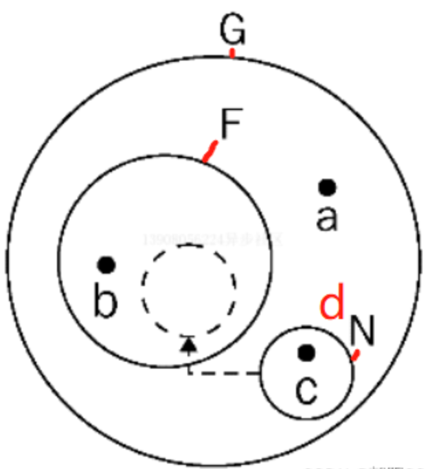

<a name="aSq6S"></a>
## 函数定义的方式
<a name="KgbRZ"></a>
#### 1、 函数式声明
function funName(arg1, arg2)<br />{<br />}<br />特点：此种方式可定义命名的函数变量，而无需给变量赋值，这是一种独立的结构，不能嵌套在非功能模块中。函数名在自身作用域和父作用域内是可获取的（其他域是娶不到的）。当解析器读取js代码时，会先读取函数的声明，此种方式定义的函数在执行任何代码之前都可以访问（调用）。
<a name="hNV3h"></a>
#### 2、 函数表达式（函数字面量）
var fun = function(arg1, arg2){<br />}<br />var fun = function funName(arg1,arg2){<br />}<br />(function hello(){<br />})()//自调用<br />特点：将函数定义为表达式语句的一部分。函数可以是命名的也可以是匿名的。而且必须等到解析器执行到它所在的代码行才能真正被解释执行。
<a name="THjK6"></a>
#### 3、 函数构造法，参数必须加引号
var fun = new Function(‘arg1’, ‘arg2’, ‘alert(arg1 + “,” + arg2)’);<br />特点：从技术角度讲，这是一个函数表达式。但是一般不推荐这种方式。
<a name="n6jtX"></a>
#### 4、 对象直接量
var obj = {<br />name:"",<br />getName: function () {<br />    return this.name<br />},<br />setName : function(name){<br />this.name = name<br />}<br />};<br />特点：将方法的定义看做为一个对象的成员变量，此时对象的变量值为一个方法，通过访问该对象的属性名称，达到调用方法的效果。
<a name="Af05e"></a>
#### 5、 原型继承
var obj = new Function();<br />obj.prototype = {<br />name:"",<br />getName:function(){<br />return this.name;<br />},<br />setName: function (name) {<br />this.name = name;<br />}<br />};<br />特点：定义了一个函数对象，在其原型对象中定义方法。在使用prototype的方法时，必须实例化该对象才能调用其方法。
<a name="XIXaA"></a>
#### 6、 工厂模式
function obj(){<br />var temp = new Object();<br />temp.name = “”;<br />temp.getName = function(){<br />return this.name;<br />};<br />temp.setName(name){<br />this.name = name;<br />};<br />return temp;<br />}<br />特点：工厂模式是软件工程领域一种广为人知的设计模式，由于在ECMAScript中无法创建类，因此用函数封装以特定接口创建对象。即在一个函数内创建一个对象，给对象赋予属性和方法再将其对象返回。
<a name="nw7NI"></a>
## 闭包
如果一个函数访问了此函数的父级及父级以上的作用域变量，那么这个函数就是一个闭包。<br />所以以下写法都是闭包
```javascript
    var a = 1;
	// 匿名的立即执行函数，因访问了全局变量a，所以也是一个闭包
    (function test (){
		alert(a);
	})()
```
本质上，JS中的每个函数都是一个闭包，因为每个函数都可以访问全局变量。<br />实现闭包最常见的方式就是函数嵌套（并不是形成闭包的唯一方式！）
```javascript
function a() {
  var i = '初始值';
  i = i + "—_执行a"
  // 此处的函数b访问了父级函数a中的局部变量i,成为了一个闭包
  function b() {
    i = i + "_执行b"
    console.log(i)
  }
  return b;
}
var c = a(); // 此时 i 的值为 ：初始值—_执行a
c()          // 此时 i 的值为 ：初始值—_执行a_执行b
c()          // 此时 i 的值为 ：初始值—_执行a_执行b_执行b

```
<a name="uiQQE"></a>
#### 闭包的执行过程
以上方代码为例：

1. 将函数a赋值给全局变量c时，a会执行一次，局部变量 i 的值变为初始值—_执行a，最终返回函数b，此时全局变量c的值为闭包函数b的引用。

此时函数a虽然已执行完，但因为内部包含闭包函数b，所以函数 a 的执行期上下文会继续保留在内存中，不会被销毁，所以局部变量 i 仍是初始值—_执行a<br />执行期上下文：当函数执行时，会创建一个执行期上下文的内部对象。每调用一次函数，就会创建一个新的上下文对象，他们之间是相互独立的。当函数执行完毕，它所产生的执行期上下文会被销毁

1. 第一次执行 c() 时，闭包函数b第一次执行，局部变量 i 的值变为初始值—_执行a_执行b
2. 第二次执行 c() 时，闭包函数b第二次执行，局部变量 i 的值变为初始值—_执行a_执行b_执行b

图解
```javascript
var a = "global variable";
var F = function () {
  var b = "local variable";
  var N = function () {
    var c = "inner local";
    return b;
  };
 return N;
};
var d = F()
d()

```
G为全局作用域<br />  


全局作用域 G 中有:<br />—— 函数 F<br />—— 全局变量 a<br />—— 全局变量 d （存有对闭包函数 N 的引用）<br />函数 F 中有: （返回闭包函数N）<br />—— 函数 F 作用域中的局部变量 b<br />—— 闭包函数 N<br />闭包函数 N 中有: （返回局部变量b）<br />—— 函数 N 作用域中的局部变量 c
<a name="vynHZ"></a>
#### 闭包的特点
1.被闭包函数访问的父级及以上的函数的局部变量（如范例中的局部变量 i ）会一直存在于内存中，不会被JS的垃圾回收机制回收。<br />2.闭包函数实现了对其他函数内部变量的访问。（函数内部的变量对外是无法访问的，闭包通过这种变通的方法，实现了访问。）
<a name="P7quk"></a>
#### Javascript的垃圾回收机制
如果一个对象不再被引用，那么这个对象就会被GC回收。<br />如果两个对象互相引用，而不再被第三者所引用，那么这两个对象都会被回收。
<a name="FWa5U"></a>
#### 闭包的用途

1. 访问函数内部的变量
2. 让变量始终保持在内存中
<a name="fM7sa"></a>
#### 闭包的应用场景
<a name="RrDnP"></a>
##### 模拟面向对象的代码风格
模拟两人对话
```javascript
function person(name) {
    function say(content) {
        console.log(name + ':' + content)
    }
    return say
}

a = person("张三")
b = person("李四")
a("在干啥？")
b("没干啥。")
a("出去玩吗？")
b("去哪啊？")

//打印效果
张三:在干啥？
李四:没干啥。
张三:出去玩吗？
李四:去哪啊？
```
<a name="BcLxn"></a>
##### 使setTimeout支持传参
通过闭包实现setTimeout第一个函数传参（默认不支持传参）
```javascript
function func(param){
    return function(){
        alert(param)
    }
}
var f1 = func(1);
setTimeout(f1,1000);

```
<a name="NxUJI"></a>
##### 封装私有变量
```javascript
//用闭包定义能访问私有函数和私有变量的公有函数。
var counter = (function () {
    var privateCounter = 0; //私有变量
    function change(val) {
        privateCounter += val;
    }
    return {
        increment: function () {
            change(1);
        },
        decrement: function () {
            change(-1);
        },
        value: function () {
            return privateCounter;
        }
    };
})();

console.log(counter.value());//0
counter.increment();
console.log(counter.value());//1
counter.increment();
console.log(counter.value());//2

```
<a name="ctjzG"></a>
##### 模拟块作用域
```javascript
<ul>
<li>click me</li>
<li>click me</li>
<li>click me</li>
<li>click me</li>
</ul>
```
运行如下代码：
```javascript
var elements = document.getElementsByTagName('li');
var length = elements.length;
for(var i=0; i<length; i++){
	elements[i].onclick = function(){
		alert(i);
	}
}
```
依次点击 4 个 li 标签，结果都弹出 4<br />解析：onclick绑定的function中没有变量 i，解析引擎会寻找父级作用域，最终找到了全局变量 i，for循环结束时，i 的值已变成了4，所以onclick事件执行时，全都弹出 4。<br />下面使用闭包来解决这个问题：
```javascript
var elements = document.getElementsByTagName('li');
var length = elements.length;
for (var i = 0; i < length; i++) {
    elements[i].onclick = function (num) {
        return function () {
            alert(num);
        };
    }(i);
}
```
通过匿名闭包，把每次的 i 都保存到一个变量中，实现了预期效果。<br />当然，通过 ES6 的 let 可以轻松解决这个问题：
```javascript
var elements = document.getElementsByTagName('li');
var length = elements.length;
for (let i = 0; i < length; i++) {
    elements[i].onclick = function () {
        alert(i);
    };
}

```
<a name="gZeAW"></a>
##### 实现迭代器
```javascript
function setup(x) {
  var i = 0;
  return function(){
    return x[i++];
  };
}
var next = setup(['a', 'b', 'c']);

```
控制台的执行效果：
```javascript
> next();
"a"
> next();
"b"
> next();
"c"

```
<a name="pDAuV"></a>
##### 闭包的优点

1. 可以减少全局变量的定义，避免全局变量的污染
2. 能够读取函数内部的变量
3. 在内存中维护一个变量，可以用做缓存
<a name="iXPX0"></a>
##### 闭包的缺点
1）造成内存泄露<br />闭包会使函数中的变量一直保存在内存中，内存消耗很大，所以不能滥用闭包，否则会造成网页的性能问题，在IE中可能导致内存泄露。<br />解决方法——使用完变量后，手动将它赋值为null；<br />2）闭包可能在父函数外部，改变父函数内部变量的值。<br />3）造成性能损失<br />由于闭包涉及跨作用域的访问，所以会导致性能损失。<br />解决方法——通过把跨作用域变量存储在局部变量中，然后直接访问局部变量，来减轻对执行速度的影响
<a name="DgaUt"></a>
## 自执行函数
自执行函数是什么？自执行函数就是当它被定义出来，就会自动执行的函数。不需要调用，传参也很方便。
```javascript
(function aaa(a,b){
  return sum = a + b
    ;})(1,2)
```
自执行函数有三种写法：<br />( function ( “ 参数 ” ) { " 函数方法 " ; } ) ( “ 给参数传的值 ” )<br />( function ( " 参数 " ) { “ 函数方法 ” ; } ( " 给参数传的值 " ) )<br />! function ( " 参数 " ) { " 函数方法 " ; } ( " 给参数传的值 " )　<br />自执行函数是很自私的，它的内部可以访问全局变量。但是除了自执行函数自身内部，是无法访问它的。
