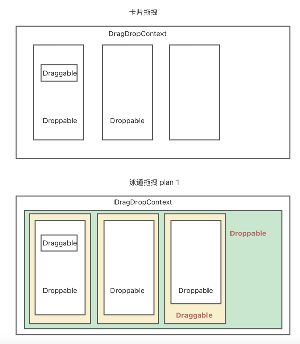
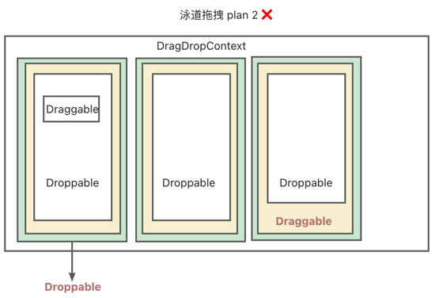
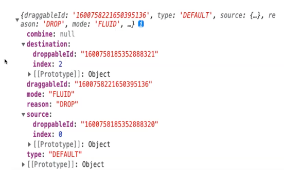
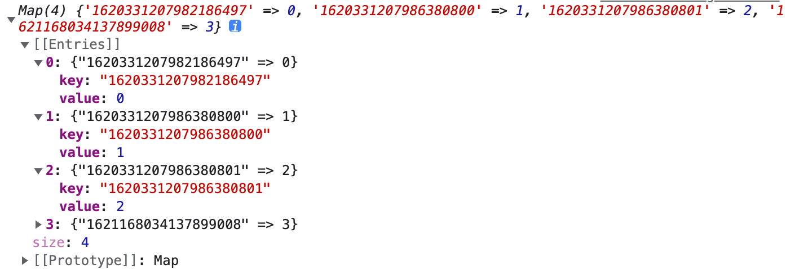
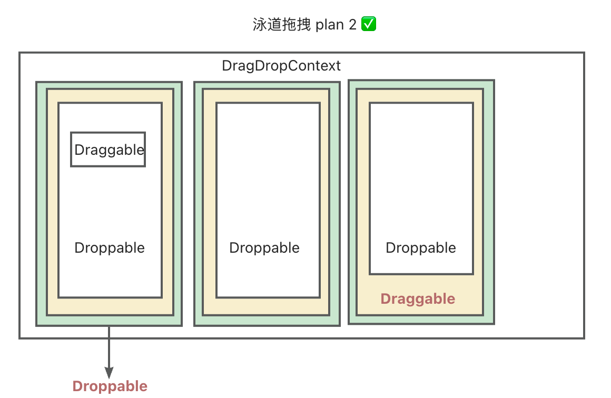
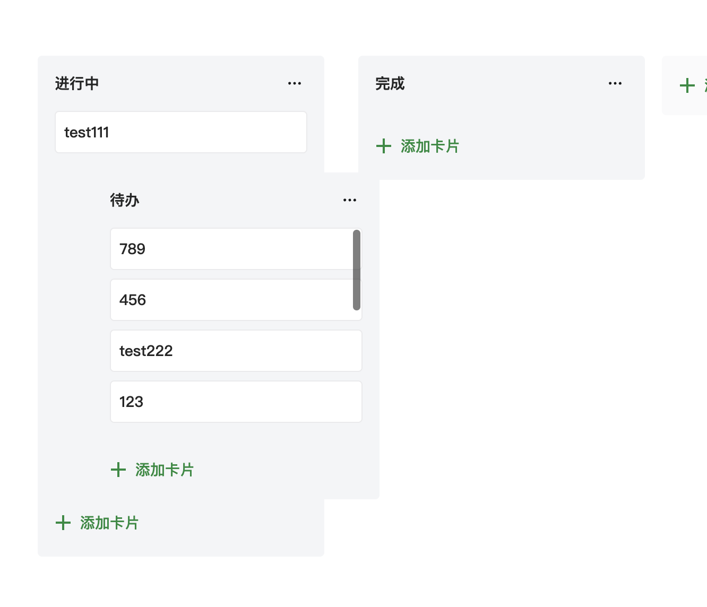
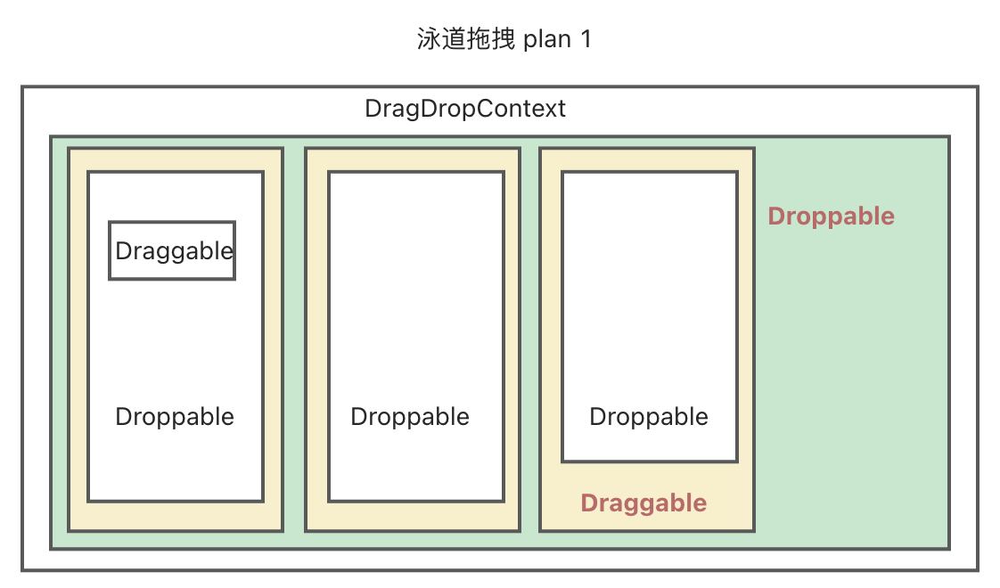
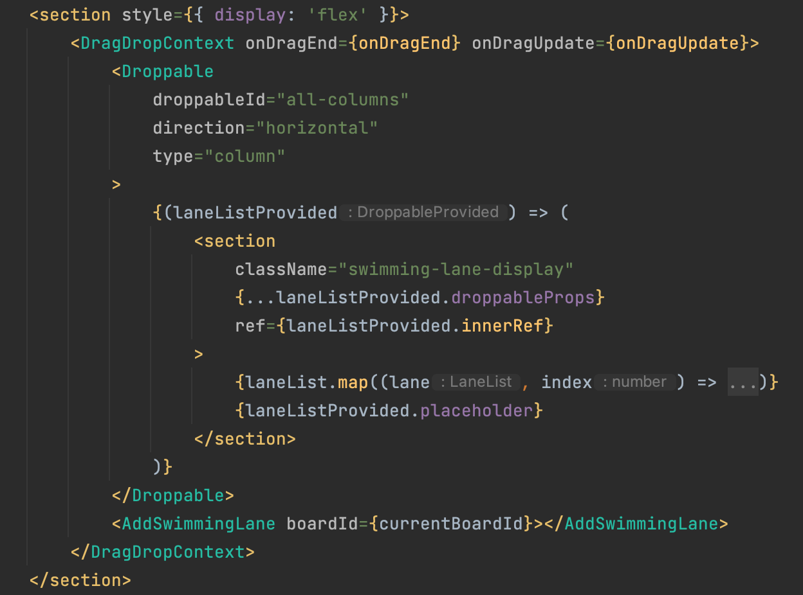

[https://github.com/atlassian/react-beautiful-dnd](https://github.com/atlassian/react-beautiful-dnd)<br />专门为列表（垂直、水平、列表间移动、嵌套列表等）构建的高级别抽象的组件。<br />API：<br /><DragDropContext />:定义启用拖放功能的区域。<br /><Droppable />:定义可被放入的区域，包含<Draggable /><br /><Draggable />:定义可被拖拽的元素。<br />**问：**

1. 层级关系，是否可以嵌套？
   1. 看看官网示例并尝试
2. 需不需要重新抽出组件？
   1. 重构可在等等



<br /><DragDropContext /> -Responders:可使用响应时间对状态/样式进行更新
<a name="T6Yvd"></a>
### 生命周期&API：
**onBeforeCapture**:拖动即将开始且为从DOM捕获尺寸，此时可以添加或删除<Draggable />和<Droppable />组件或修改尺寸。<br />**对应代码**：<br />**onBeforeDragStart**:拖动即将开始并且已从DOM中捕获尺寸。<br />**对应代码：**<br />onDragStart：拖动开始。<br />**对应代码：**<br />**onDragUpdate**:用户拖动元素，只要又变化就会被调用，变化：（落位提示可能会用到）

1. <Draggable />位置改变。
2. <Draggable />位于不同的<Droppable />上。
3. <Draggable />不在<Droppable / >上。

**对应代码：**

**onDragEnd **（必需）：拖拽结束。<br />**对应代码：**<br />onDragEnd中三种情况：

1. 拖拽到<Droppable>外面
```
if (!result.destination) {
   return;
}
```
onDragEnd 中调用了moveCardInSwimmingLane，moveCardBetweenSwimmingLane，作为两种不同情况。

2. moveCardInSwimmingLane  // 单泳道移动，重排卡片
3. moveCardBetweenSwimmingLane  // 泳道间移动，重排卡片

这两个方法理解：计算最后拖拽位置（list中的排序）<br />问：

1. 只出现了onDragEnd，完成卡片目标效果，生命周期中其他函数是不是不需要改动？
   1. 在后续落位提示的功能可能需要使用新的API接口
2. 后续的泳道的拖拽结束API是否也写在卡片的onDragEnd方法中？还是重新定义？是否抽组件？
   1. 单独的onDragEnd方法，重新命名定义，可先实现功能在考虑重构。
3. 泳道的拖拽方法是不是类似单泳道的卡片移动？
   1. <br />
4. 落位提示：
   - 根据destination的id改变<Droppable />的style属性？isDraging
<a name="uAKfV"></a>
### 生命周期api返回参数
onDragEnd = （result:DropResult）=>{xxx}

DropResult:

- draggable:被拖拽元素的id
- destination：目标属性
   - droppableId：目标<Droppable >的id
   - index：在目标<Droppable />中的下标
- source：原始属性的信息
   - droppableId：起始<Droppable >的id
   - index：在起始<Droppable />中的下标
  
 

<br />卡片：API:http://{{ip}}:{{port2}}/api/boards/1620331207982186496/swimmingLanes/cards<br />问：<br />泳道有新的API吗？<br />在swimmingTitle.jsx中有用到
```
export function changeSwimmingLanePosition(laneId: string, position: number) {
   return request
      .patch('swimmingLanes/' + laneId, {
         position: position,
      })
      .then((res) => res);
}
```


```json
"code": 20000,
    "message": "成功",
    "data": {
        "swimmingLanes": [
            {
                "id": "1620331207982186497",
                "title": "待办"
            },
            {
                "id": "1620331207986380800",
                "title": "进行中"
            },
            {
                "id": "1620331207986380801",
                "title": "完成"
            },
            {
                "id": "1621168034137899008",
                "title": "123"
            }
        ],
        "cards": [
            [],//?
            [
                {
                    "id": "1620332383888867328",
                    "title": "do something123",
                    "description": null,
                    "swimmingLaneId": "1620331207986380800",
                    "beginAt": null,
                    "endAt": null,
                    "status": 0,
                    "labels": [
                        {
                            "id": "1624999986427199488",
                            "title": "基础标签1",
                            "color": "#BFDCB4",
                            "boardId": "1620331207982186496"
                        },
                        {
                            "id": "1625436008722071552",
                            "title": null,
                            "color": "#BFDCB4",
                            "boardId": "1620331207982186496"
                        }
                    ],
                    "members": [
                        {
                            "id": "1620697932842008576",
                            "userId": "1620697840336633856",
                            "userName": "linhua",
                            "boardId": "1620331207982186496",
                            "role": "member",
                            "star": false
                        },
                        {
                            "id": "1620697932842008576",
                            "userId": "1620697840336633856",
                            "userName": "linhua",
                            "boardId": "1620331207982186496",
                            "role": "member",
                            "star": false
                        },
                        {
                            "id": "1620697958993494016",
                            "userId": "1620697553546903552",
                            "userName": "xiaoming",
                            "boardId": "1620331207982186496",
                            "role": "member",
                            "star": false
                        }
                    ],
                    "position": 1
                }
            ],
            [
                {
                    "id": "1621013270527868928",
                    "title": "something",
                    "description": "1234",
                    "swimmingLaneId": "1620331207986380801",
                    "beginAt": null,
                    "endAt": null,
                    "status": 0,
                    "labels": [],
                    "members": [],
                    "position": 1
                }
            ],
            [
                {
                    "id": "1621013381387517952",
                    "title": "do something",
                    "description": null,
                    "swimmingLaneId": "1621168034137899008",
                    "beginAt": null,
                    "endAt": null,
                    "status": 0,
                    "labels": [],
                    "members": [],
                    "position": 1
                },
                {
                    "id": "1621168070741590016",
                    "title": "123456",
                    "description": null,
                    "swimmingLaneId": "1621168034137899008",
                    "beginAt": null,
                    "endAt": null,
                    "status": 0,
                    "labels": [],
                    "members": [],
                    "position": 2
                }
            ]
        ]
    }
}
```
<a name="Fs67D"></a>
### Map.get()

<br />什么是JavaScript中的Map？

- Map是JavaScript中的数据结构，它允许存储[键，值]对，其中任何值都可以用作键或值。
- Map集合中的键和值可以是任何类型，并且如果使用集合中已存在的键将值添加到Map集合中，则新值将替换旧值。
- 映射对象中元素的迭代按插入顺序完成，并且“for…”循环为每次迭代返回所有[键，值]对的数组。

JavaScript中对象与Map之间的差异<br />这两种数据结构在许多方面都是相似的，例如都使用键存储值，允许使用键检索这些值，删除键并验证键是否具有任何值。但是，JavaScript中的对象和Map之间存在相当大的差异，这使得在许多情况下使用Map成为更好，更可取的选择。

- 映射中使用的键可以是任何类型的值，例如函数，对象等，而对象中的键则限于符号和字符串。
- 通过使用size属性可以轻松知道Map的大小，但是在处理对象时，必须手动确定大小。
- 在要求涉及频繁添加和删除[键，值]对的情况下，最好使用Map，因为map是一种迭代数据类型，可以直接进行迭代，而迭代对象需要以特定方式获取其键。

JavaScript中的Map.get()方法<br />JavaScript中的Map.get()方法用于返回Map中存在的所有元素之中的特定元素。<br />Map.get()方法将要返回的元素的键作为参数，并返回与作为参数传递的指定键相关联的元素。如果映射中不存在作为参数传递的键，则Map.get()方法将返回undefined。<br />应用范围：<br />Map.get()方法用于获取Map中所有元素中的特定元素。
<a name="ilvl4"></a>
### Array.from
Array.from：允许在 JavaScript 集合(如: 数组、类数组对象、或者是字符串、map 、set 等可迭代对象) 上进行有用的转换。<br />Array.from(arrayLike[, mapFunction[, thisArg]])

- arrayLike：必传参数，想要转换成数组的伪数组对象或可迭代对象。
- mapFunction：可选参数，mapFunction(item，index){...} 是在集合中的每个项目上调用的函数。返回的值将插入到新集合中。
- thisArg：可选参数，执行回调函数 mapFunction 时 this 对象。这个参数很少使用。

<a name="zuxEw"></a>
## 问题
<a name="QiM9a"></a>
#### 问题1
onDragEnd方法写在onDragDropContext中，onDragDropContext中包含泳道的拖放区域（<Droppable><Draggabel>）和卡片的拖放区域，二者无法区分，导致泳道可以拖到卡片的位置中。<br />
  

<br />原因：<br />解决：

1. ❌将<Droppable>的droppableId从lane.id替换成index，⚠️index需要转换为字符串格式，index.toString()
   1. 卡片不可移动
2. 改变层级，采用plan1
   
 
<a name="iev2s"></a>
#### 问题2:
怎样区分卡片拖拽和泳道拖拽？<br />在<droppable>组件中添加type的props属性，区分泳道和卡片，可在onDragEnd方法中判断type来调用不同的方法。
<a name="vlgZC"></a>
#### 问题3:
落位提示？


