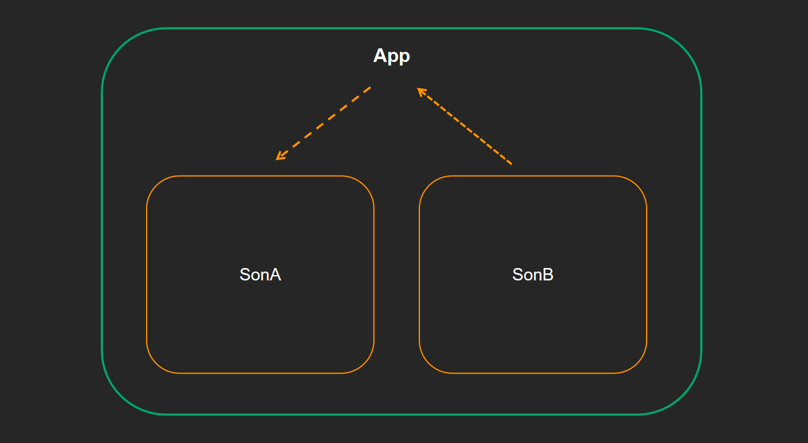
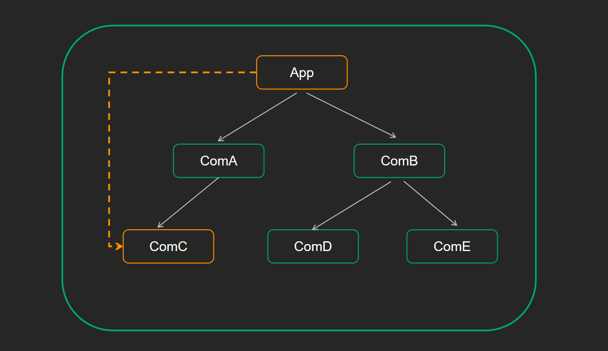

<a name="i4chT"></a>
## 核心思想
通过状态提升机制，利用共同的父组件实现兄弟通信。  

<a name="IoJD7"></a>
## 实现步骤

1. 将共享状态提升到最近的公共父组件中，由公共父组件管理这个状态 
   - 提供共享状态
   - 提供操作共享状态的方法
2. 要接收数据状态的子组件通过 props 接收数据
3. 要传递数据状态的子组件通过props接收方法，调用方法传递数据
```javascript
import React from 'react'

// 子组件A
function SonA(props) {
  return (
    <div>
      SonA
      {props.msg}
    </div>
  )
}
// 子组件B
function SonB(props) {
  return (
    <div>
      SonB
      <button onClick={() => props.changeMsg('new message')}>changeMsg</button>
    </div>
  )
}

// 父组件
class App extends React.Component {
  // 父组件提供状态数据
  state = {
    message: 'this is message'
  }
  // 父组件提供修改数据的方法
  changeMsg = (newMsg) => {
    this.setState({
      message: newMsg
    })
  }

  render() {
    return (
      <>
        {/* 接收数据的组件 */}
        <SonA msg={this.state.message} />
        {/* 修改数据的组件 */}
        <SonB changeMsg={this.changeMsg} />
      </>
    )
  }
}

export default App
```
<a name="4374244d"></a>
## 跨组件通信Context
  
<br />上图是一个react形成的嵌套组件树，如果我们想从App组件向任意一个下层组件传递数据，Context 提供了一个**无需为每层组件手动添加 props，就能在组件树间进行数据传递的方法**<br />**实现步骤**<br />1- 创建Context对象 导出 Provider 和 Consumer对象
```javascript
const { Provider, Consumer } = createContext()
```
2- 使用Provider包裹上层组件提供数据 
```javascript
<Provider value={this.state.message}>
    {/* 根组件 */}
</Provider>
```
3- 需要用到数据的组件使用Consumer包裹获取数据
```javascript
<Consumer >
    {value => /* 基于 context 值进行渲染*/}
</Consumer>
```
**代码实现**
```javascript
import React, { createContext }  from 'react'

// 1. 创建Context对象 
const { Provider, Consumer } = createContext()


// 3. 消费数据
function ComC() {
  return (
    <Consumer >
      {value => <div>{value}</div>}
    </Consumer>
  )
}

function ComA() {
  return (
    <ComC/>
  )
}

// 2. 提供数据
class App extends React.Component {
  state = {
    message: 'this is message'
  }
  render() {
    return (
      <Provider value={this.state.message}>
        <div className="app">
          <ComA />
        </div>
      </Provider>
    )
  }
}

export default App
```
