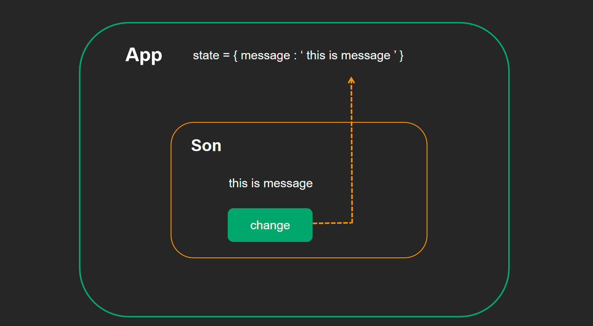

<a name="EemMw"></a>
## 组件通信的意义
组件是独立且封闭的单元，默认情况下组件只能使用自己的数据。<br />组件化的开发的过程中，完整的功能会拆分多个组件，在这个过程中不可避免的需要互现哥传递一些数据为了能让各组件之间进行互相沟通，数据传递，这个过程就是组件通信。<br />1.父子关系-最重要的<br />2.兄弟关系-自定义时间模式产生技术方法eventBus/通过共同的父组件通信<br />3.其他关系-mobx/redux/基于hool的方案
<a name="QbGOe"></a>
## 父传子
目标：实现父子通信中的父传子，把父组件中的数据传给子组件<br />实现步骤：

1. 父组件提供要传递的数据 -state
2. 给子组件标签条件属性值为state中的数据
3. 子组件中通过props接收父组件中穿过的数据
   1. 类组件使用this.props获取props对象
   2. 函数式组件直接通过参数获取props对象
<a name="CaOuv"></a>
### props说明
<a name="Zs8E6"></a>
#### props是只读对象（readonly）
根据单项数据流的要求，子组件只能读取props中的数据，不能进行修改。
<a name="tJeck"></a>
#### props可以传递任意数据
数字、字符串、布尔值、数组、对象、函数、JSX
<a name="VOC8Y"></a>
#### props的解构
const {list , userInfo , getMessage} = props
<a name="dpFMb"></a>
## 子传父
子组件调用父组件传递过来的函数，并且把想要传递的数据当成函数的实参传入即可。

```javascript
import React from 'react'

// 子组件
function Son(props) {
  function handleClick() {
    // 调用父组件传递过来的回调函数 并注入参数
    props.changeMsg('this is newMessage')
  }
  return (
    <div>
      {props.msg}
      <button onClick={handleClick}>change</button>
    </div>
  )
}


class App extends React.Component {
  state = {
    message: 'this is message'
  }
  // 提供回调函数
  changeMessage = (newMsg) => {
    console.log('子组件传过来的数据:',newMsg)
    this.setState({
      message: newMsg
    })
  }
  render() {
    return (
      <div>
        <div>父组件</div>
        <Son
          msg={this.state.message}
          // 传递给子组件
          changeMsg={this.changeMessage}
        />
      </div>
    )
  }
}

export default App
```
