# 脚手架是什么
+ 编程中脚手架是一种工具,可以帮我们快速生成项目的工程化结构
##  React 脚手架
  + React 脚手架: create-react-app, 可以帮我们生成一个通用的目录结构,并且已经将我们所需要的工程环境配置好
  +  React 脚手架是使用 node 编写的,并且是基于 webpack 的,所以必须要在自己的电脑上安装 node 环境。
  + 安装指令: npm install -g create-react-app, 安装成功后可以使用 create-react-app --version 查看版本
## create-react-app 方法
### 全局安装
`npm i create-react-app -g`
### 创建React项目
切换到想创建项目的目录，使用命令  
`create-react-app my-project`  
一直处于加载过程

## vite创建React项目
### 1. Vite概述
+ Vite 也是一个提供基本项目脚手架和开发服务器的构建工具。 然而，Vite 并不是基于 Webpack 的，它有自己的开发服务器，利用浏览器中的原生 ES 模块。 这种架构使得 Vite 比 Webpack 的开发服务器快了好几个数量级。Vite 采用 Rollup 进行构建，速度也更快。
+ Vite 官方中文文档 https://cn.vitejs.dev/
+ https://juejin.cn/post/6844904199692484615
### 2. 创建基本模板项目
运行命令安装脚手架  
`yarn create vite`  
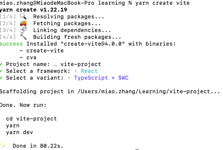  
得到目录结构如下  
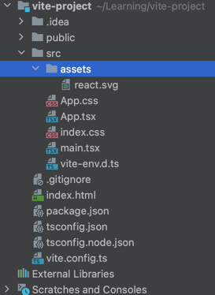    
执行yarn得到yarn超时的info
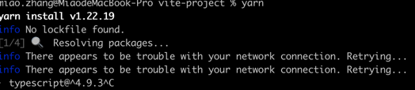  
查找解决方案，更换淘宝镜像  
https://www.cnblogs.com/Insist-Y/p/16592899.html  
#查看代理`yarn config list`  
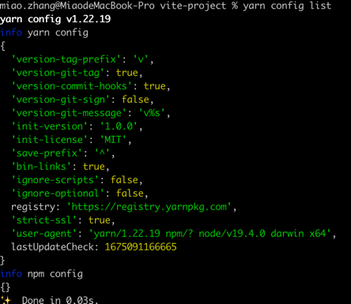  
#删除代理 `yarn config delete proxy`
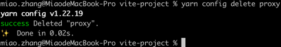  
#更换淘宝镜像  
`yarn config set registry https://registry.npm.taobao.org`  
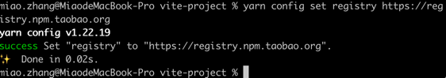  
再次执行yarn  
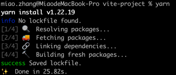

### 3. 配置
待学习

## react-cli创建React项目
### 1. 安装react-cli脚手架
`npm install build-react -g`
### 2. 使用脚手架搭建项目
`build-react init my-react`  
会出来一些问题，比如：项目名称之类的，可以设置一下。
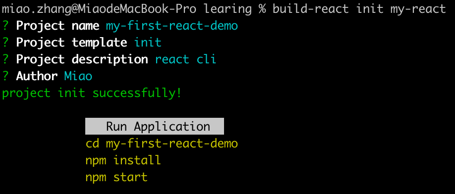
tips:
+ init为通用项目模版，配置了常用的react工具。
+ complete-project为完整的react项目，包括请求工具，服务转发，登录注册，复杂嵌套路由。
+ simple-project为简单项目模版，提供了react以及react-router基本配置。
### 3. 进入项目
cd 项目名称 //进入到项目的路径下
npm install //安装项目依赖
npm start //运行项目
#### 4. 遇到的问题
npm install 过程中  
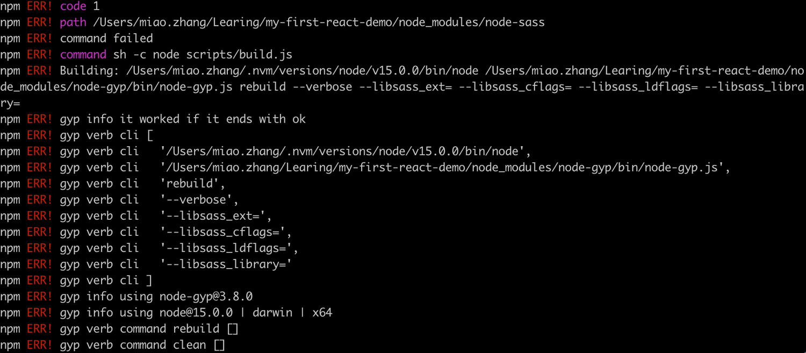
解决方案1:
https://blog.csdn.net/qq_30346433/article/details/125713220

执行1：
`npm uninstall node-sass`  
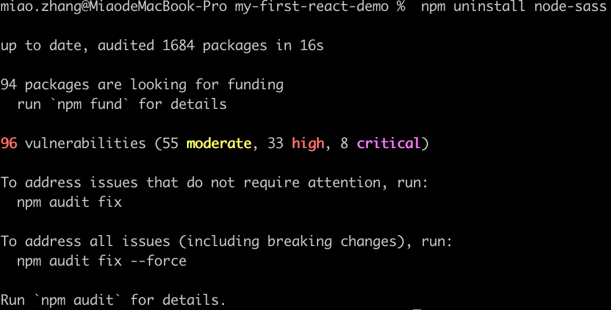

执行2：
`npm i -D sass`   
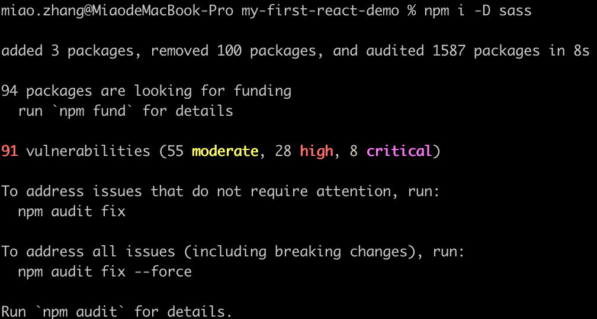

再次运行npm install结果  
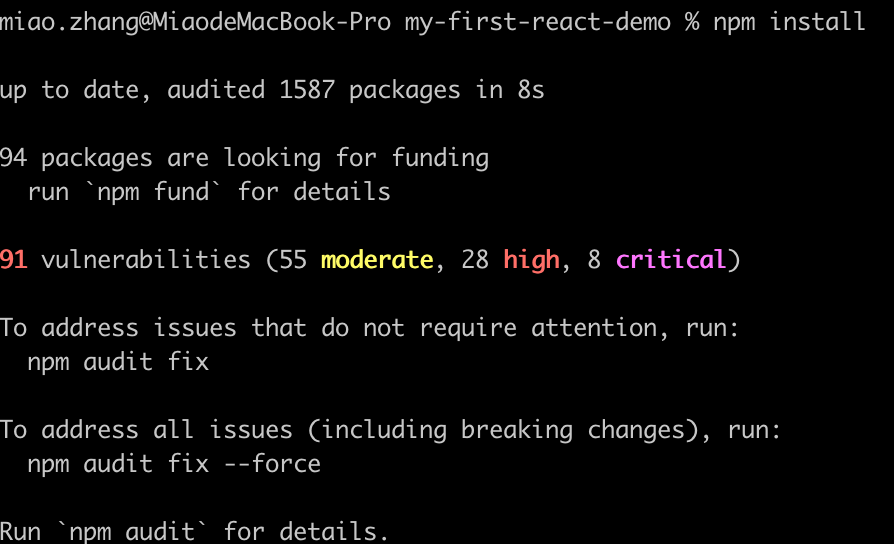

### 5. 启动项目
启动项目的时候,可以在配置文件package.json,加入--open,这样项目就能自动打开默认的浏览器运行了。如：
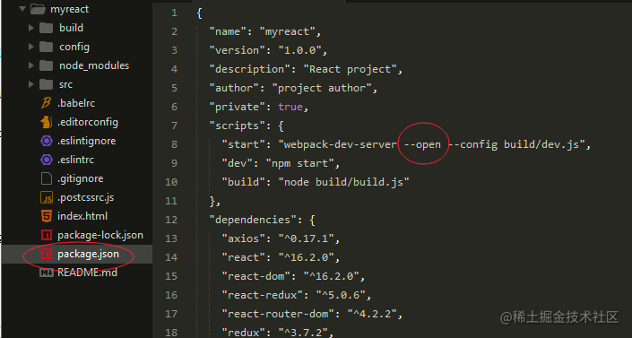

### 6. 打包项目
`npm run build`
