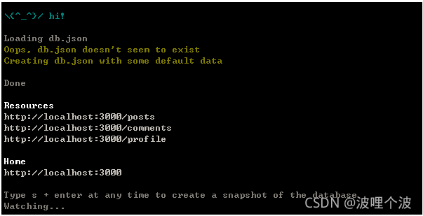
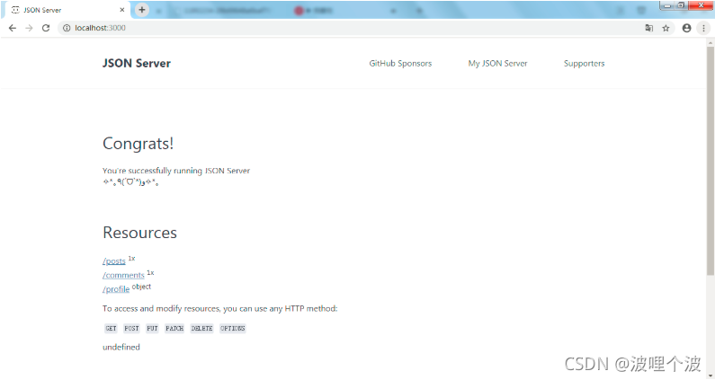
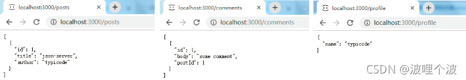
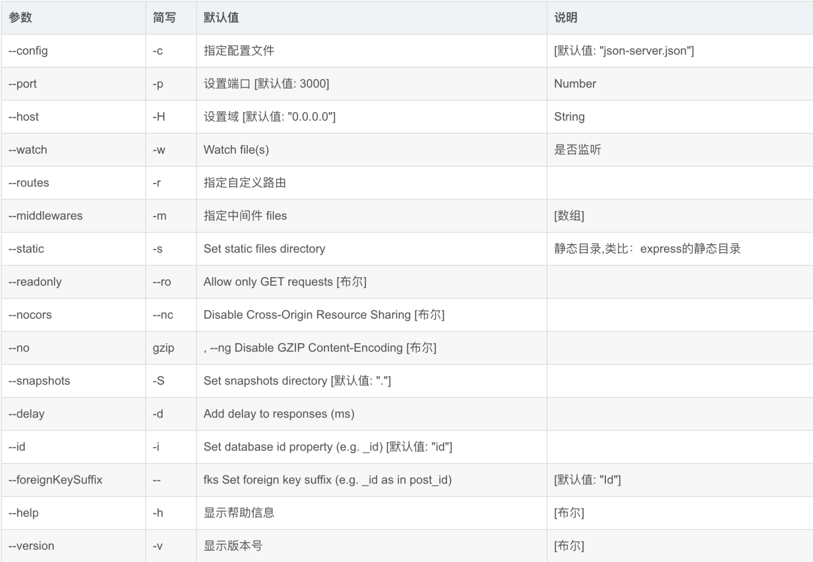

<a name="e2GGP"></a>
## json-server概述
 一个在前端本地运行，可以存储json数据的server。<br />通俗来说，就是模拟服务端接口数据，一般用在前后端分离后，前端人员可以不依赖API开发，而在本地搭建一个JSON服务，自己产生测试数据。<br />顾名思义，json-server就是个存储json数据的server~。<br /> json-server网址：[https://www.npmjs.com/package/json-server](https://www.npmjs.com/package/json-server)
<a name="mYebH"></a>
## 下载安装
使用npm全局安装json-server：<br />`npm install -g json-server`<br />可以通过查看版本号，来测试是否安装成功：<br />`json-server -v`
<a name="Gdaz2"></a>
## 创建json数据——db.json
既然是造数据，就需要创建一个json数据。<br />在任意一个文件夹下（此处假设我创建了一个myserver文件夹），进入到该文件夹里面，执行代码：
```
json-server --watch db.json
```

<br />原本空空如也的文件夹里，就会多出一个db.json文件。<br />同时，根据执行代码结果的提示，我们可以访问 [http://localhost:3000](http://localhost:3000/) 
（启动json-server后，点击才有效）,看到如下页面：<br />

<br />可以分别点击/posts /comment /profile /db链接，看看页面跳转后，观察地址栏变化和页面内容，你看到了什么？<br />没错，就是各自的json数据。<br />
 
<br />**db.json里面自带的数据:**
```
{
  "posts": [
    {
      "id": 1,
      "title": "json-server",
      "author": "typicode"
    }
  ],
  "comments": [
    {
      "id": 1,
      "body": "some comment",
      "postId": 1
    }
  ],
  "profile": {
    "name": "typicode"
  }
}
```
再比对myserver/db.json文件的数据，就可以发现： /db就是整个的db.json数据包，而/posts /comment /profile 分别是db.json里面的子对象。<br />**所以说，json-server把db.json 根节点的每一个key，当作了一个router。我们可以根据这个规则来编写测试数据。**
<a name="HSwW0"></a>
## 修改端口号
json-server 默认是 3000 端口，我们也可以自己指定端口，指令如下：
```
json-server --watch db.json --port 3004
```
嗯，如果你很懒，觉得启动服务的这段代码有点长，还可以考虑db.json同级文件夹（也就是myserver文件夹）新建一个package.json，把配置信息写在里头：
```

{
    "scripts": {
        "mock": "json-server db.json --port 3004"
    }
}
```
之后启动服务，只需要执行如下指令就可以了：
```
npm run mock
```
<a name="dZjUD"></a>
## json-server 的相关启动参数

- 语法：json-server [options] <source>
- 选项列表

参数	简写	默认值	说明<br />--config	-c	指定配置文件	[默认值: "json-server.json"]<br />--port	-p	设置端口 [默认值: 3000]	Number<br />--host	-H	设置域 [默认值: "0.0.0.0"]	String<br />--watch	-w	Watch file(s)	是否监听<br />--routes	-r	指定自定义路由	<br />--middlewares	-m	指定中间件 files	[数组]<br />--static	-s	Set static files directory	静态目录,类比：express的静态目录<br />--readonly	--ro	Allow only GET requests [布尔]	<br />--nocors	--nc	Disable Cross-Origin Resource Sharing [布尔]	<br />--no	gzip	, --ng Disable GZIP Content-Encoding [布尔]	<br />--snapshots	-S	Set snapshots directory [默认值: "."]	<br />--delay	-d	Add delay to responses (ms)	<br />--id	-i	Set database id property (e.g. _id) [默认值: "id"]	<br />--foreignKeySuffix	--	fks Set foreign key suffix (e.g. _id as in post_id)	[默认值: "Id"]<br />--help	-h	显示帮助信息	[布尔]<br />--version	-v	显示版本号	[布尔]
<br /><br />**三、操作数据**<br />我们先自己倒腾下 db.json 数据，比如现在是个水果商城，放点 用户信息 和 水果价格 信息：
```
{
    "fruits": [
        {
            "id": 1,
            "name": "苹果",
            "price": 1.28
        },
        {
            "id": 2,
            "name": "橘子",
            "price": 3.88
        },
        {
            "id": 3,
            "name": "西瓜",
            "price": 1.98
        }
    ],
    "users": [
        {
            "name": {
                "username":"admin",
                "nickname":"zhangsan"
            },
            "pwd": "123456"
        }
    ]
}
```
要注意，数据格式符合JSON格式（尤其注意最后一个键值对后面不要有逗号）。如果数据格式有误，命令窗口会报错，可以根据错误提示进行修整。<br />接下来我们就可以GET, POST, PUT, PATCH or DELETE 方法来对数据进行操作。
<a name="tx9FL"></a>
## 获取数据
首先，我们先来看GET操作。<br />浏览器地址访问就可以看做GET操作，所以不用写任何代码，我们就可以先来测试下 url -GET 操作。
<a name="PSC8S"></a>
### 常规获取
```
    http://localhost:3004/fruits
```
可以得到所有水果数据（对象数组）
```
[
    {
        "id": 1,
        "name": "苹果",
        "price": 1.28
    },
    {
        "id": 2,
        "name": "橘子",
        "price": 3.88
    },
    {
        "id": 3,
        "name": "西瓜",
        "price": 1.98
    }
]
```
<a name="zPPv6"></a>
### 过滤获取 Filter
根据id获取数据
```
    http://localhost:3004/fruits/1
```
可以得到指定id为1的水果（对象）：
```

{
    "id": 1,
    "name": "苹果",
    "price": 1.28
}
```
当然，指定id为1的获取指令还可以用如下指令，但要注意，此时返回的数据是一个**数组**。
```
 http://localhost:3004/fruits?id=1
```
```
[
    {
        "id": 1,
        "name": "苹果",
        "price": 1.28
    }
]
```
以此类推，我们也可以通过水果名称，或者是价格来获取数据：
```
    http://localhost:3004/fruits?name=橘子
```
```
[
    {
        "id": 2,
        "name": "橘子",
        "price": 3.88
    }
]
```
也可以指定多个条件，用&符号连接：
```
    http://localhost:3004/fruits?name=橘子&price=3.88
```
```
[
    {
        "id": 2,
        "name": "橘子",
        "price": 3.88
    }
]
```
你甚至还可以使用对象取属性值 obj.key 的方式：
```
    http://localhost:3004/users?name.nickname=zhangsan
```
```
[
  {
    "name": {
      "username": "admin",
      "nickname": "zhangsan"
    },
    "pwd": "123456"
  }
]
```
以上看着是不是特别眼熟，不就是HTTP中GET请求方式嘛~<br />嗯，更好玩的还在后面。
<a name="T19D6"></a>
### 分页 Paginate
为了能演示分页效果，我们在db.json文件里的fruits里面多添加了几种水果。
```
{
    "fruits": [
        {
            "id": 1,
            "name": "糖心富士苹果",
            "price": 2.38
        },
        {
            "id": 2,
            "name": "橘子",
            "price": 3.88
        },
        {
            "id": 3,
            "name": "宁夏西瓜",
            "price": 1.98
        },
        {
            "id": 4,
            "name": "麒麟西瓜",
            "price": 3.98
        },
        {
            "id": 5,
            "name": "红蛇果",
            "price": 2.5
        },
        {
            "id": 6,
            "name": "黑皮西瓜",
            "price": 0.98
        },
        {
            "id": 7,
            "name": "红心火龙果",
            "price": 2.69
        },
        {
            "id": 8,
            "name": "国产火龙果",
            "price": 1.69
        },
        {
            "id": 9,
            "name": "海南荔枝",
            "price": 9.9
        },
        {
            "id": 10,
            "name": "陕西冬枣",
            "price": 5.39
        },
        {
            "id": 11,
            "name": "软籽石榴",
            "price": 2.39
        },
        {
            "id": 12,
            "name": "蜜橘",
            "price": 1.99
        },
        {
            "id": 13,
            "name": "海南香蕉",
            "price": 1.45
        }
    ],
    "users": [
        {
            "name": {
                "username":"admin",
                "nickname":"zhangsan"
            },
            "pwd": "123456"
        }
    ]
}
```
编辑过db.json（db.json数据有变动），都要关闭服务重新启动。（注意：不要用 CTRL + C 来停止服务，因为这种方式会导致 node.js 依旧霸占着3004端口，导致下一次启动失败。简单粗暴关闭窗口即可！ window系统，其他系统可能没有这样的烦恼。）<br />分页采用 _page 来设置页码， _limit 来控制每页显示条数。如果没有指定 _limit ，默认每页显示10条。
```
    http://localhost:3004/fruits?_page=2&_limit=5
```
```
[
    {
        "id": 6,
        "name": "黑皮西瓜",
        "price": 0.98
    },
    {
        "id": 7,
        "name": "红心火龙果",
        "price": 2.69
    },
    {
        "id": 8,
        "name": "国产火龙果",
        "price": 1.69
    },
    {
        "id": 9,
        "name": "海南荔枝",
        "price": 9.9
    },
    {
        "id": 10,
        "name": "陕西冬枣",
        "price": 5.39
    }
]
```
<a name="DtuCo"></a>
### 排序 Sort
排序采用 _sort 来指定要排序的字段， _order 来指定排序是正排序还是逆排序（asc | desc ，默认是asc）。
```
    http://localhost:3004/fruits?_sort=price&_order=desc
```
```
[
    {
        "id": 9,
        "name": "海南荔枝",
        "price": 9.9
    },
    {
        "id": 10,
        "name": "陕西冬枣",
        "price": 5.39
    },
    {
        "id": 4,
        "name": "麒麟西瓜",
        "price": 3.98
    },
    {
        "id": 2,
        "name": "橘子",
        "price": 3.88
    },
    {
        "id": 7,
        "name": "红心火龙果",
        "price": 2.69
    },
    {
        "id": 5,
        "name": "红蛇果",
        "price": 2.5
    },
    {
        "id": 11,
        "name": "软籽石榴",
        "price": 2.39
    },
    {
        "id": 1,
        "name": "糖心富士苹果",
        "price": 2.38
    },
    {
        "id": 12,
        "name": "蜜橘",
        "price": 1.99
    },
    {
        "id": 3,
        "name": "宁夏西瓜",
        "price": 1.98
    },
    {
        "id": 8,
        "name": "国产火龙果",
        "price": 1.69
    },
    {
        "id": 13,
        "name": "海南香蕉",
        "price": 1.45
    },
    {
        "id": 6,
        "name": "黑皮西瓜",
        "price": 0.98
    }
]
```
也可以指定多个字段排序，一般是按照price进行排序后，相同price的再根据id排序：
```
    http://localhost:3004/fruits?_sort=price,id&_order=desc,asc
```
<a name="PFlYO"></a>
### 取局部数据 Slice
slice的方式，和 Array.slice() 方法类似。采用 _start 来指定开始位置， _end 来指定结束位置、或者是用_limit来指定从开始位置起往后取几个数据。
```
    http://localhost:3004/fruits?_start=2&_end=4
```
```
[
    {
        "id": 3,
        "name": "宁夏西瓜",
        "price": 1.98
    },
    {
        "id": 4,
        "name": "麒麟西瓜",
        "price": 3.98
    }
]
```
```
    http://localhost:3004/fruits?_start=2&_limit=4
```
```
[
    {
        "id": 3,
        "name": "宁夏西瓜",
        "price": 1.98
    },
    {
        "id": 4,
        "name": "麒麟西瓜",
        "price": 3.98
    },
    {
        "id": 5,
        "name": "红蛇果",
        "price": 2.5
    },
    {
        "id": 6,
        "name": "黑皮西瓜",
        "price": 0.98
    }
]
```
<a name="kTYiC"></a>
### 取符合某个范围 Operators
（1）采用 _gte _lte 来设置一个取值范围（range）:
```
    http://localhost:3004/fruits?id_gte=4&id_lte=6
```
```
[
    {
        "id": 4,
        "name": "麒麟西瓜",
        "price": 3.98
    },
    {
        "id": 5,
        "name": "红蛇果",
        "price": 2.5
    },
    {
        "id": 6,
        "name": "黑皮西瓜",
        "price": 0.98
    }
]
```
（2）采用_ne来设置不包含某个值：
```
    http://localhost:3004/fruits?id_ne=1&id_ne=10
```
```
[
    {
        "id": 2,
        "name": "橘子",
        "price": 3.88
    },
    {
        "id": 3,
        "name": "宁夏西瓜",
        "price": 1.98
    },
    {
        "id": 4,
        "name": "麒麟西瓜",
        "price": 3.98
    },
    {
        "id": 5,
        "name": "红蛇果",
        "price": 2.5
    },
    {
        "id": 6,
        "name": "黑皮西瓜",
        "price": 0.98
    },
    {
        "id": 7,
        "name": "红心火龙果",
        "price": 2.69
    },
    {
        "id": 8,
        "name": "国产火龙果",
        "price": 1.69
    },
    {
        "id": 9,
        "name": "海南荔枝",
        "price": 9.9
    },
    {
        "id": 11,
        "name": "软籽石榴",
        "price": 2.39
    },
    {
        "id": 12,
        "name": "蜜橘",
        "price": 1.99
    },
    {
        "id": 13,
        "name": "海南香蕉",
        "price": 1.45
    }
]
```
（3）采用_like来设置匹配某个字符串（或正则表达式）：
```
    http://localhost:3004/fruits?name_like=果
```
```
[
    {
        "id": 1,
        "name": "糖心富士苹果",
        "price": 2.38
    },
    {
        "id": 5,
        "name": "红蛇果",
        "price": 2.5
    },
    {
        "id": 7,
        "name": "红心火龙果",
        "price": 2.69
    },
    {
        "id": 8,
        "name": "国产火龙果",
        "price": 1.69
    }
]
```
<a name="amCpq"></a>
### 全文搜索 Full-text search
采用 q 来设置搜索内容:
```
    http://localhost:3004/fruits?q=3
```
```
[
    {
        "id": 1,
        "name": "糖心富士苹果",
        "price": 2.38
    },
    {
        "id": 2,
        "name": "橘子",
        "price": 3.88
    },
    {
        "id": 3,
        "name": "宁夏西瓜",
        "price": 1.98
    },
    {
        "id": 4,
        "name": "麒麟西瓜",
        "price": 3.98
    },
    {
        "id": 10,
        "name": "陕西冬枣",
        "price": 5.39
    },
    {
        "id": 11,
        "name": "软籽石榴",
        "price": 2.39
    },
    {
        "id": 13,
        "name": "海南香蕉",
        "price": 1.45
    }
]
```
除了获取数据，我们当然还希望能向操作sql一样能更改数据、删除数据了。<br />所以这里，我们采用大部分人熟悉的 ajax 方法，来操作下响应的数据。
<a name="dvkGT"></a>
### 案例
获取db.json中的所有水果信息，以表格的方式展现出来。
```html
<!DOCTYPE html>
<html>

  <head>
    <title>使用jquery ajax方法操作数据</title>
    <script type="text/javascript" src="js/jquery.js"></script>
    <style>
      table,
      td,
      th {
        border: 1px solid black;
        border-collapse: collapse;
      }

      table {
        width: 500px;
        text-align: center;
      }

      tr {
        height: 35px;
      }
    </style>
  </head>

  <body>
    <button id="getBtn">获取所有水果数据</button>
    <div id="showData"></div>

    <script type="text/javascript">
      $("#getBtn").click(function () {
        $.ajax({
          type: 'get',
          url: 'http://localhost:3004/fruits',
          success: function (data) {
            // data 对象数组
            var h = ""
            h += "<table border='1'>"
            h += "<thead><th>ID</th><th>name</th><th>price</th></thead>"
            h += "<tbody>"
            for (var i = 0; i < data.length; i++) {
              var o = data[i]
              h += "<tr>"
              h += "<td>" + o.id + "</td><td>" + o.name + "</td><td>" + o.price + "</td>"
              h += "</tr>"
            }
            h += "<tbody>"
            h += "</table>"
            $("#showData").empty().append(h)
          },
          error: function () {
            alert("get : error")
          }
        })
      })
    </script>
  </body>

</html>
```

<a name="ycfhk"></a>
## 添加数据
POST 方法，常用来创建一个新资源。<br />案例：在页面的输入框中输入新的水果名称和价格，通过post添加到db.json中。
```html
水果：<input id="fruitName" type="text" name="fruitName"><br>
价格：<input id="fruitPrice" type="text" name="fruitPrice"><br>
<button id="postBtn">添加水果</button>
```
```javascript
$("#postBtn").click(function () {
  $.ajax({
    type: 'post',
    url: 'http://localhost:3004/fruits',
    data: {
      name: $("#fruitName").val(),
      price: $("#fruitPrice").val()
    },
    success: function (data) {
      console.log("post success")
    },
    error: function () {
      alert("post error")
    }
  })
})
```
输入 猕猴桃 2.68 水果后 添加水果 按钮添加新水果。再次点击get按钮重新获取db.json数据，就可以看到新添加进去的数据。此时打开db.json文件，也可以看到这条新添加的记录。<br /><br />注意：此时如果再次点击 添加水果 按钮，重复添加猕猴桃 2.68 数据，会发现在get中存在多条 id 不一样但 name & price 相同的重复数据。
<a name="xHKov"></a>
## 更新数据
PUT 方法，常用来更新已有资源，若资源不存在，它也会进行创建。<br />案例：输入水果对应id，修改其价格。
```html
<p>更新水果价格</p>
水果id：<input id="putId" type="text" name="fruitId"><br>
价格：<input id="putPrice" type="text" name="fruitPrice"><br>
<button id="putBtn">put更新</button>
```
```javascript
$("#putBtn").click(function () {
  $.ajax({
    type: 'put',
    url: 'http://localhost:3004/fruits/' + $("#putId").val(),
    data: {
      price: $("#putPrice").val()
    },
    success: function (data) {
      console.log("put success")
    },
    error: function () {
      alert("put error")
    }
  })
})
```
在案例中，我们输入id 为 1 ，更改价格为100，本意是要更新 糖心富士苹果 的价格为100，但PUT方法执行后，get到的数据name 字段 的 糖心富士苹果 变成 undefined 了。<br /><br />这是因为，PUT方法会更新整个资源对象，前端没有给出的字段，会自动清空。所以，要么我们在ajax的data中给出完整的对象信息，要么采用PATCH方法。<br />PATCH是一个新方法，可以当作是PUT方法的补充，主要用来做局部更新。<br />案例：同PUT方法。
```javascript
$("#putBtn").click(function () {
  $.ajax({
    type: 'patch',
    url: 'http://localhost:3004/fruits/' + $("#putId").val(),
    data: {
      price: $("#putPrice").val()
    },
    success: function (data) {
      console.log("put success")
    },
    error: function () {
      alert("put error")
    }
  })
})
```
此处，我们输入id 为 2 ，更改价格为200，即要更新 橘子 的价格为200，执行PATCH方法后，get到的数据name 字段 的 橘子 的价格确实变化了，而且不会像PUT方法，导致 name 变成 undefined 。<br /><br />但有时候，我们更希望能通过输入水果名称，来动态更新水果价格。但 '[http://localhost:3004/fruits/](http://localhost:3004/fruits/)橘子' 这种 url 是错误的，而像 '[http://localhost:3004/fruits?name](http://localhost:3004/fruits?name) = 橘子' 这种url，只能供 GET 方法来获取数据。既然如此，我们就多绕个弯，通过GET方法来获知id，然后再通过id去PATCH数据。
```javascript
<p>通过水果名更新水果价格</p>
水果：<input id="editName" type="text" name="fruitName"><br>
价格：<input id="editPrice" type="text" name="fruitPrice"><br>
<button id="editBtn">edit</button>
```
```javascript
$("#editBtn").click(function () {
    getFun($("#editName").val(), patchFun)
})
 
function getFun(name, f) {
    $.ajax({
        type: 'get',
        url: 'http://localhost:3004/fruits' + '?name=' + name,
        success: function (data) {
            // data 对象数组
            console.log(data[0]);
            if (typeof f == "function") f.call(this, data[0].id)
        },
        error: function () {
            alert("error")
        }
    })
}
 
function patchFun(id) {
    $.ajax({
        type: 'patch',
        url: 'http://localhost:3004/fruits/' + id,
        data: {
            price: $("#editPrice").val()
        },
        success: function (data) {
            console.log("success", data)
        },
        error: function () {
            alert("error")
        }
    })
}
```
<a name="OQC8k"></a>
## 删除数据
DELETE 方法，常用来删除已有资源<br />案例：根据id删除水果数据
```html
<p>删除水果</p>
水果id：<input id="delId" type="text" name="delName"><br>
<button id="delOne">根据id删除</button>
<button id="delAll">删除所有</button>
```
```javascript
$("#delOne").click(function () {
  $.ajax({
    type: 'delete',
    url: 'http://localhost:3004/fruits/' + $("#delId").val(),
    success: function (data) {
      console.log("del success")
    },
    error: function () {
      alert("del error")
    }
  })
})
```
若想用删除全部，没办法使用'http://localhost:3004/fruits' 这种请求url。<br />因为必须指定删除的对象id。所以只能通过循环删除。这就需要实现通过GET方法来获取当前最大id（注意是最大id，而不是数据个数）来作为循环的边界。
```javascript
$("#delAll").click(function () {
    // 此处就没有动态去获取db.json中fruits的最大id，直接带入10
    for (var i = 0; i <= 10; i++) {
        delFun(i)
    }
})
 
function delFun(id) {
    $.ajax({
        type: 'delete',
        url: 'http://localhost:3004/fruits/' + id,
        data: '',
        success: function (data) {
            console.log("del success", data)
        },
        error: function () {
            console.log("del error")
        }
    })
}
```
<a name="HFxil"></a>
# 四、配置静态资源服务器(待)
主要是用来配置图片、音频、视频资源<br />通过命令行配置路由、数据文件、监控等会让命令变的很长，而且容易敲错；<br />json-server允许我们把所有的配置放到一个配置文件中，这个配置文件一般命名为json_sever_config.json;<br />**json_sever_config.json**
```
{
  "port": 3004,            
  "watch": true,           
  "static": "./public",
  "read-only": false, 
  "no-cors": false, 
  "no-gzip": false
}
```
**package.json**
```
{
    "scripts": {
        "mock": "json-server --c json_sever_config.json db.json"
    }
}
```
我们可以把我们的图片资源都放在public目录中，但是public目录不仅可以放图片，也可以放音频和视频，所有大家放资源的时候，在public下面创建images用来放置图片，创建audio/video分别放置音频和视频；<br />      既然我们已经在json_server_config.json里面指明了静态文件的目录，那么我们访问的时候，就可以忽略public；<br />图片：[http://localhost:3004/@2x_about.png](mailto:http://localhost:3004/@2x_about.png)

