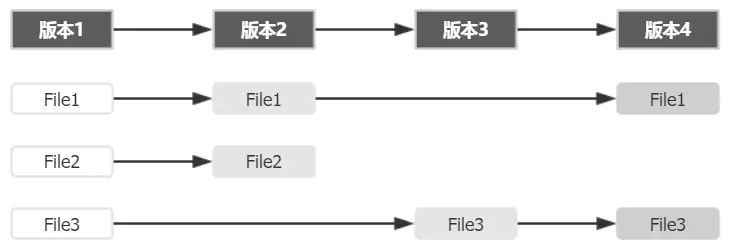
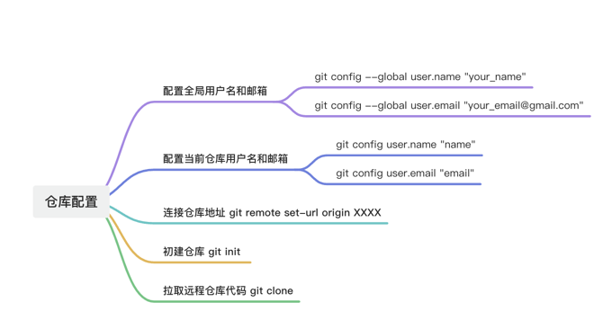
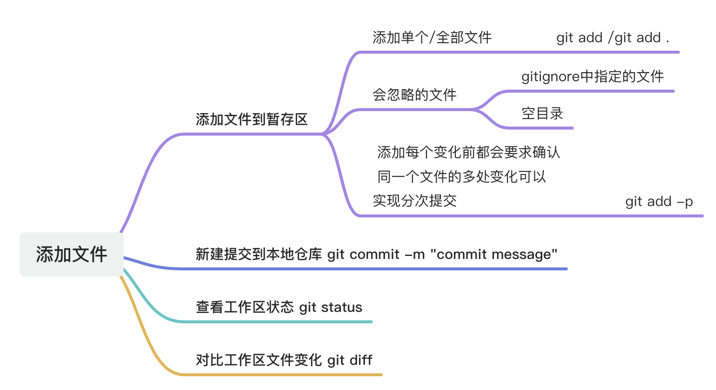
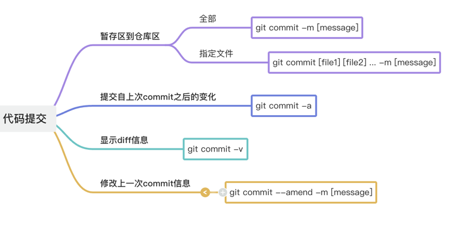
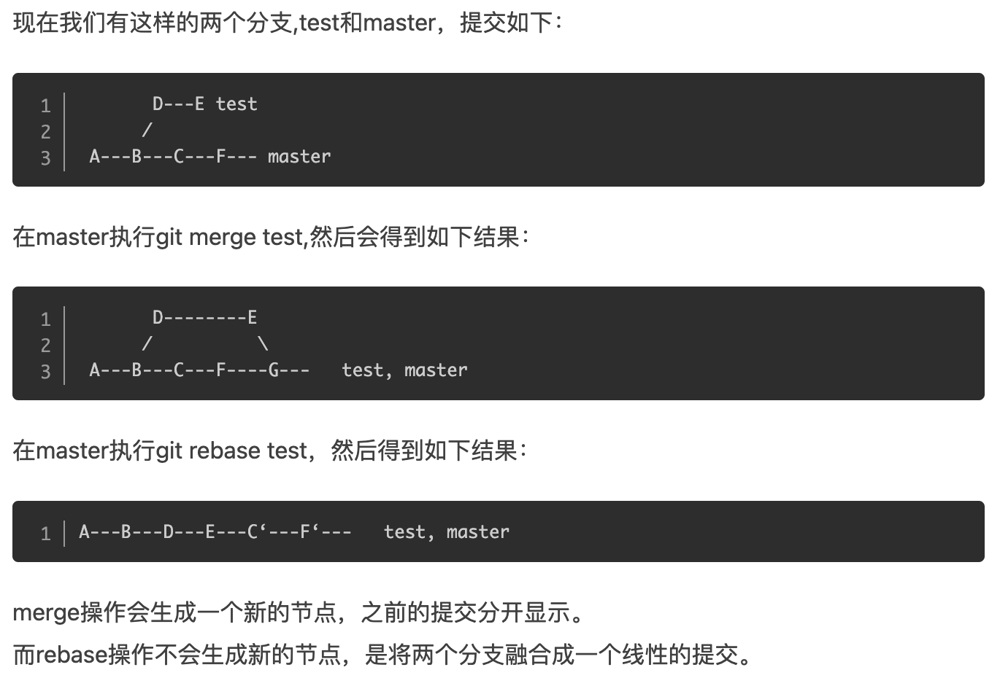

# Git  
## 1.理论基础
Git 记录的是什么？  
  
如上，如果每个版本中有文件发生变动，Git 会将整个文件复制并保存起来。这种设计看似会多消耗更多的空间，但在分支管理时却是带来了很多的益处和便利。  
**三棵树**  
你的本地仓库有 Git 维护的三棵“树”组成，这是 Git 的核心框架。这三棵树分别是：工作区域、暂存区域和 Git 仓库
  
+ 工作区域（Working Directory）就是你平时存放项目代码的地方。  
+ 暂存区域（Stage）用于临时存放你的改动，事实上它只是一个文件，保存即将提交的文件列表信息。  
+ Git 仓库（Repository）就是安全存放数据的位置，这里边有你提交的所有版本的数据。其中，HEAD 指向最新放入仓库的版本  
+ (这第三棵树，确切的说，应该是 Git 仓库中 HEAD 指向的版本）  

+  Git 的工作流程一般是：  
    + 1. 在工作目录中添加、修改文件；
     + 2. 将需要进行版本管理的文件放入暂存区域；
    + 3. 将暂存区域的文件提交到 Git 仓库。
   因此，Git 管理的文件有三种状态：已修改（modified）、已暂存（staged）和已提交（committed），依次对应上边的每一个流程。  

## 2.安装配置环境

### 2.1 git下载与安装
点击Git，然后选择下载安装包  
`git --version`，终端输入该命令，  
如输出版本号，则说明安装成功。  
`git version 2.20.1`
### 2.2 git基本配置
  
+ 通过下面这些指令，配置用户名和邮箱  
`git config --global user.name "your_name"  `
+ 名字和邮箱需要用双引号包裹，回车之后，如路径没有任何变化说明设置成功；  
`git config --global user.email "your_email@gmail.com"  `
+ 此处的邮箱账号可以是假的账号，但是格式必须复合邮箱格式，同样回车成功之后路径不会有变化；  
`git config core.ignorecase false  `
+ 配置本地仓库文件大小写敏感，建议配置，以免文件更新有误；  
`git config --list  `
## 3.增加/删除文件  
  
1. 添加指定文件到暂存区  
   `git add [file1] [file2] ...  `
2. 添加指定目录到暂存区，包括子目录  
   `git add [dir]  `
3. 添加当前目录的所有文件到暂存区  
   `git add .  `
4. 添加每个变化前，都会要求确认，对于同一个文件的多处变化，可以实现分次提交  
  ` git add -p  `  
5. 删除工作区文件，并且将这次删除放入暂存区  
  `git rm [file1] [file2] ...  `  
6. 停止追踪指定文件，但该文件会保留在工作区  
   `git rm --cached [file] `   
7. 改名文件，并且将这个改名放入暂存区  
   `git mv [file-original] [file-renamed] `
## 4.代码提交
  
1. 提交暂存区到仓库区  
   `git commit -m [message]`  
2. 提交暂存区的指定文件到仓库区  
  `git commit [file1] [file2] ... -m [message]`  
3. 提交工作区自上次commit之后的变化，直接到仓库区  
   `git commit -a`  
4. 提交时显示所有diff信息  
   `git commit -v`  
5. 使用一次新的commit，替代上一次提交，如果代码没有任何新变化，则用来改写上一次commit的提交信息  
   `git commit --amend -m [message]`
6. 重做上一次commit，并包括指定文件的新变化   
   `git commit --amend [file1] [file2] ...`
## 5.分支

1. 列出所有本地分支

git branch

2. 列出所有远程分支

git branch -r

3. 列出所有本地分支和远程分支

git branch -a

4. 新建一个分支，但依然停留在当前分支

git branch [branch-name]

5. 新建一个分支，并切换到该分支

git checkout -b [branch]

6. 新建一个分支，指向指定commit

git branch [branch] [commit]

7. 新建一个分支，与指定的远程分支建立追踪关系

git branch --track [branch] [remote-btanch]

8. 切换到指定分支，并更新工作区

git checkout [branch-name]

9. 切换到上一个分支

git checkout -

10. 建立追踪关系，在现有分支与指定的远程分支之间

git branch --set-upstrean [branch] [remote-branch]

11. 合并指定分支到当前分支

git merge [branch]

12. 选择一个commit，合并进当前分支

git cherry-pick [commit]

13. 删除分支

git branch -d [branch-name]

14. 删除远程分支

git push origin --delete [branch-name] git branch -dr [remote/branch]

## 6.查看信息

1. 显示有变更的文件

git status

2. 显示当前分支的版本历史

git log

3. 显示commit历史，以及每次commit发生变更的文件

git log --stat

4. 搜索提交历史，根据关键词

git log  -S [keyword]

5. 显示某个commit之后的所有变动，每个commit占据一行

git log [tag] HEAD --pretty=format:%s

6. 显示某个commit之后的所有变动，其"提交说明"必须符合搜索条件

git log [tag] HEAD --grep feature

7. 显示某个文件的版本历史，包括文件改名

git log --flow [file] git whatchanged [file]

8. 显示指定文件相关的每一次diff

git log -p [file]

9. 显示过去5次提交

git log -5 --pretty --online

10. 显示所有提交过的用户，按提交次数排序

git shortlog -sn

11. 显示指定文件是什么人在什么时间修改过

git blame [file]

12. 显示暂存区和工作区的差异

git diff

13. 显示暂存区和上一个commit的差异

git diff --cached [file]

14. 显示工作区与当前分支最新commit之间的差异

git diff HEAD

15. 显示两次提交之间的差异

git diff [first-branch]...[second-branch]

16. 显示今天你写了多少行代码

git diff --shortstat "@{0 day ago}"

17. 显示某次提交的元数据和内容变化

git show [commit]

18. 显示某次提交发生变化的文件

git show --name-only [commit]

19. 显示某次提交时，某个文件的内容

git show [commit]:[filename]

20. 显示当前分支的最近几次提交

git reflog

## 7.远程同步

1. 下载远程仓库的所有变动

git fetch [remote]

2. 显示所有远程仓库

git remote -v

3. 显示某个远程仓库的信息

git remote show [remote]

4. 增加一个新的远程仓库，并命名

git remote add [shortname] [url]

5. 取回远程仓库的变化，并与本地分支合并

git pull [remote] [branch]

6. 上传本地指定分支到远程仓库

git push [remote] [branch]

7. 强行推送当前分支到远程仓库，即使有冲突

git push [remote] --force

8. 推送所有分支到远程仓库

git push [remote]  --all

## 8.撤销

1. 恢复暂存区的指定文件到工作区

git checkout [file]

2. 恢复某个commit的指定文件到暂存区和工作区

git checkout [commit] [file]

3. 恢复暂存区的所有文件到工作区

git checkout

4. 重置暂存区的指定文件，与上一次commit保持一致，但工作区不变

git reset [file]

5. 重置暂存区与工作区，与上一次commit保持一致

git reset --hard

6. 重置当前分支的指针为指定commit，同时重置暂存区，但工作区不变

git reset [commit]

7. 重置当前分支的HEAD为指定commit，同时重置暂存区和工作区，与指定commit一致

git reset --hard [commit]

8. 重置当前HEAD为指定commit，但保持暂存区和工作区不变

git reset --keep [commit]

9. 新建一个commit，用来撤销指定commit，后者的所有变化都将被前者抵消，并且应用到当前分支

git revert [commit]

10. 暂时将未提交的变化移除，稍后再移入

git stash git stash pop

## 9.其他

1. 生成一个可供发布的压缩包

git archive

# 10.git pull --rebase 与 git pull区别

### 10.1 功能不同
git pull = git fetch + git merge FETCH_HEAD   git pull --rebase =  git fetch + git rebase FETCH_HEAD

### 10.2 merge和rebase

### 10.3 rebase的好处
想要更好的提交树，使用rebase操作会更好一点。 这样可以线性的看到每一次提交，并且没有增加提交节点。 merge 操作遇到冲突的时候，当前merge不能继续进行下去。手动修改冲突内容后，add 修改，commit 就可以了。 而rebase 操作的话，会中断rebase,同时会提示去解决冲突。 解决冲突后,将修改add后执行**git rebase –continue**继续操作，或者**git rebase –skip**忽略冲突

