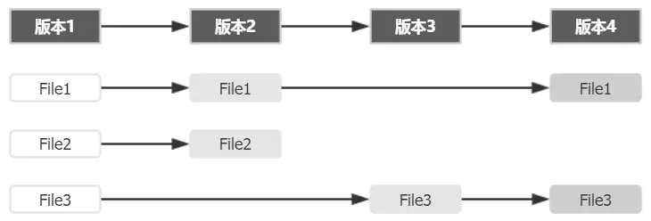
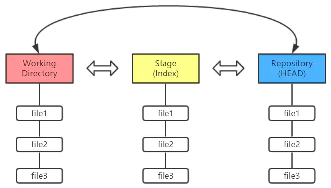
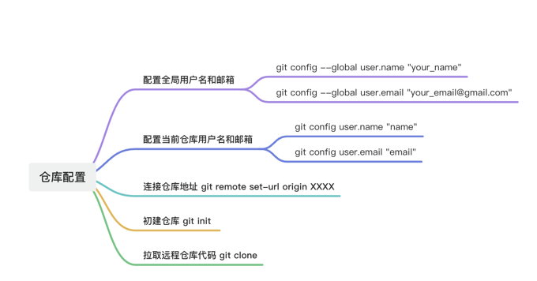

# Git  
## 1.理论基础
Git 记录的是什么？  
  
如上，如果每个版本中有文件发生变动，Git 会将整个文件复制并保存起来。这种设计看似会多消耗更多的空间，但在分支管理时却是带来了很多的益处和便利。  
**三棵树**  
你的本地仓库有 Git 维护的三棵“树”组成，这是 Git 的核心框架。这三棵树分别是：工作区域、暂存区域和 Git 仓库
  
+ 工作区域（Working Directory）就是你平时存放项目代码的地方。  
+ 暂存区域（Stage）用于临时存放你的改动，事实上它只是一个文件，保存即将提交的文件列表信息。  
+ Git 仓库（Repository）就是安全存放数据的位置，这里边有你提交的所有版本的数据。其中，HEAD 指向最新放入仓库的版本  
+ (这第三棵树，确切的说，应该是 Git 仓库中 HEAD 指向的版本）  

+  Git 的工作流程一般是：  
    + 1. 在工作目录中添加、修改文件；
     + 2. 将需要进行版本管理的文件放入暂存区域；
    + 3. 将暂存区域的文件提交到 Git 仓库。
   因此，Git 管理的文件有三种状态：已修改（modified）、已暂存（staged）和已提交（committed），依次对应上边的每一个流程。  

## 2.安装配置环境

### 2.1 git下载与安装
点击Git，然后选择下载安装包  
`git --version`，终端输入该命令，  
如输出版本号，则说明安装成功。  
`git version 2.20.1`
### 2.2 git基本配置
  
+ 通过下面这些指令，配置用户名和邮箱  
`git config --global user.name "your_name"  `
+ 名字和邮箱需要用双引号包裹，回车之后，如路径没有任何变化说明设置成功；  
`git config --global user.email "your_email@gmail.com"  `
+ 此处的邮箱账号可以是假的账号，但是格式必须复合邮箱格式，同样回车成功之后路径不会有变化；  
`git config core.ignorecase false  `
+ 配置本地仓库文件大小写敏感，建议配置，以免文件更新有误；  
`git config --list  `
