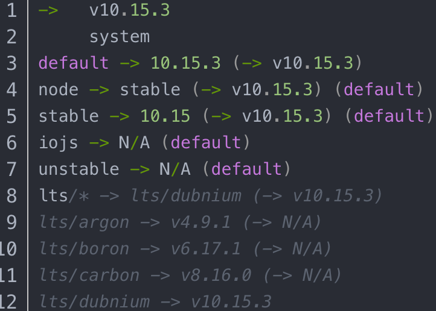
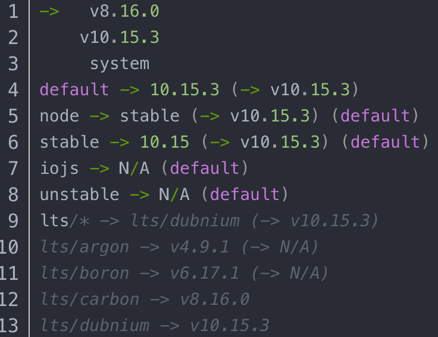
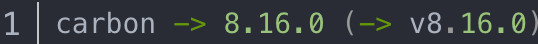
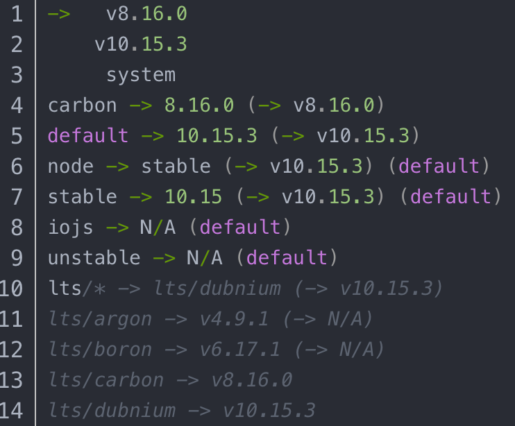

# nvm使用教程
### 容易混淆的概念
+ Node.js：基于Chrome V8引擎的JS运行环境（javascript代码运行环境）
+ npm： 第三方js插件包管理工具，会随着node一起安装（Node package Manager）
+ npx：npm5.2之后新增的npx命令
  + 优点： 
   1. 直接到当前项目node_moudle/.bin/路径和$PATH下，寻找命令
   2. 避免全局安装，比如脚手架类型的库，通常只会在初始化时用一次，
      此时就可以通过npmx create-react-app这种方式调用，执行这个命令时，
      npx会将create-react-app下载到一个临时目录，使用完后再删除。
## nvm介紹
node的版本管理器，可以方便地安装&切换不同版本的node

随着大前端的快速发展，node版本更新很快，我们在工作中，可以会有老版本的node的项目需要维护，也可能有新版本的node的项目需要开发，如果我们只有一个node版本的话将会很麻烦，nvm可以解决我们的难点

### 1. 下载
下载地址：https://github.com/coreybutler/nvm-windows/releases
#### mac下载nvm
+ 1、brew install nvm，首先要保证之前没有安装过node，如果之前安装过，就先 brew uninstall node
+ 2、上面的操作之后，终端可能会报错：Command failed with exit 128: git，不要着急，这是终端输入brew -v ，回提示添加git config --global --add safe.directory /usr/local/Homebrew/Library/Taps/homebrew/homebrew-core和git config --global --add safe.directory /usr/local/Homebrew/Library/Taps/homebrew/homebrew-cask,只要将两行代码复制到终端执行，之后再重新brew install nvm，之后就是等待了
+ 3.下载完之后，需要在环境变量的文件中添加 echo "source $(brew --prefix nvm)/nvm.sh" >> .bash_profile，并source ~/.bash_profile保存变量，之后就可以正常使用了

#### 下载node
`brew install node`  
### 2. 使用nvm管理Node.js多版本
#### 2.1 安装
+ 安装最新版本的node：  
`nvm install node`
+ 安装特定版本的node：  
`nvm install 10.15.3`
+ 可以查看目前有哪些node可以安装：
`nvm ls-remote`
+ 安装一个node的新版本以后，通过指令 nvm ls 查看会返回如下结果  

#### 2.2 node 版本切换
+ 使用如下指令切换node版本：
`nvm use system`
+ 返回如下内容，代表已经切换到system版本：  
Now using system version of node: v8.11.3 (npm v6.4.1)
+ 输入如下指令，切换到刚刚安装的版本：  
`nvm use 10.5.3`
+ 返回如下内容，代表已经切换到10.15.3版本：  
Now using system version of node: v10.5.3 (npm v6.4.1)
+ 对于目前的10.15.3，应为它是第一个通过nvm安装的node版本，所以自动给它分配了一个alias：default。所以，也可以通过这个指令切换到这个版本上  
`nvm use default`  
+ 也可以通过这个指令切换到已安装的最新的版本：  
`nvm use node`   
+ 由于目前最新的版本就是default的10.15.3，所以就等同于nvm use default。
+ 再安装一个版本：8.16.0。输入指令nvm install 8.16.0，返回如下内容：  
  
发现比之前多了一行-> v8.16.0，并且8.16.0被应用。

#### 2.3 给特定版本分配alias
从8.16.0切换到别的版本以后，如果再想切换回来，只能通过nvm use 8.16.0。8.16.0不方便记忆，也不方便输入，可以通过给这个版本设置一个alias，来解决这个问题。输入如下指令：
`nvm alias carbon 8.16.0`  
返回的结果：
  
此时，再次输入nvm ls，会返回如下结果  
  
会发现多了一行carbon -> 8.16.0 (-> v8.16.0)，这代表carbon就是版本8.16.0，所以如果想切换到8.16.0，可以输入如下指令：  
`nvm use carbon`  
也可以通过alias指令，改变default所代表的版本：  
`nvm alias default 8.16.0`
8.16.0就成为default版本了。  
输入nvm alias可以查看都有哪些已经设置好的alias。  
还可以通过nvm unalias carbon来取消carbon这个alias。  
#### 2.4 卸载node
`nvm uninstall alias/node `  
注意：不能卸载当前正在运行中的node版本。  
可以通过nvm uninstall来查看有哪些版本可以卸载。
### 3. nvm常用指令
+ nvm list 是查找本电脑上所有的node版本  
  + nvm list 查看已经安装的版本
  + nvm list installed 查看已经安装的版本
  + nvm list available 查看网络可以安装的版本
    nvm install 安装最新版本nvm

+ nvm use 切换使用指定的版本node

+ nvm ls 列出所有版本

+ nvm current显示当前版本

+ nvm alias   给不同的版本号添加别名

+ nvm unalias  删除已定义的别名

+ nvm reinstall-packages  在当前版本node环境下，重新全局安装指定版本号的npm包

+ nvm on 打开nodejs控制

+ nvm off 关闭nodejs控制

+ nvm proxy 查看设置与代理

+ nvm node_mirror [url] 设置或者查看setting.txt中的node_mirror，如果不设置的默认是 https://nodejs.org/dist/
+ nvm npm_mirror [url] 设置或者查看setting.txt中的npm_mirror,如果不设置的话默认的是： https://github.com/npm/npm/archive/.

+ nvm uninstall  卸载制定的版本

+ nvm use [version] [arch] 切换制定的node版本和位数

+ nvm root [path] 设置和查看root路径

+ node-sass: Command failed. 查看当前的版本

